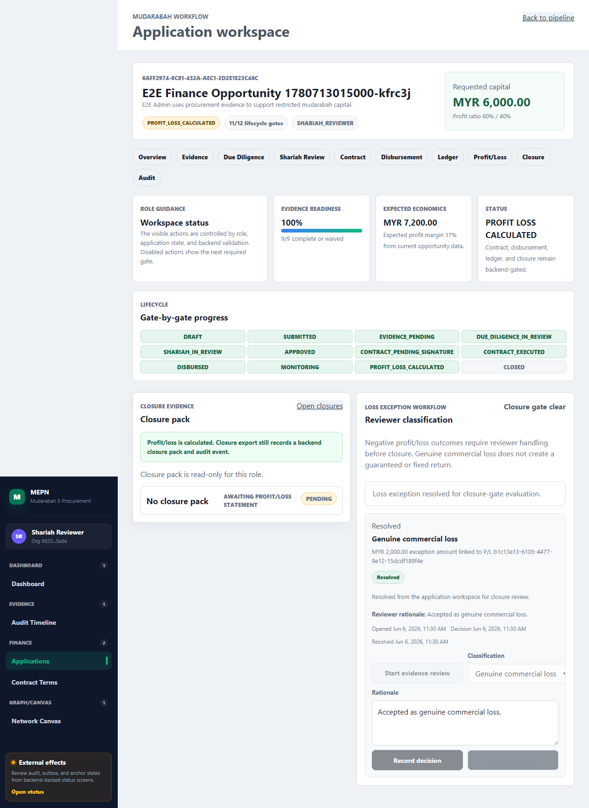

# Loss Exception Workflow Evidence

## Status

Implemented for the current FYP review scope.

The finance workflow now distinguishes a genuine commercial loss from breach,
negligence, misconduct, fraud, and insufficient evidence without creating a
guaranteed fixed return. Negative profit/loss can create a backend-owned loss
exception, closure is blocked while the exception is unresolved, and reviewers
can record evidence review, classification rationale, and closure resolution
from the application workspace.

## Source Evidence

| Area | Evidence |
|---|---|
| Domain contract | `docs/domain/loss-exception-workflow.md` |
| Prisma model/migration | `apps/api/prisma/schema.prisma`, `apps/api/prisma/migrations/20260606004000_loss_exception_lifecycle/` |
| Backend service/API | `apps/api/src/modules/finance/finance.service.ts`, `apps/api/src/modules/finance/loss-exceptions/` |
| Frontend UI | `apps/web/src/features/finance/applications/workspace/LossExceptionPanel.tsx`, `apps/web/src/features/finance/FinanceRoute.tsx` |
| Web API client | `apps/web/src/features/finance/api/useLossExceptions.ts` |
| E2E proof | `tests/e2e/17-loss-exception-workflow.spec.ts` |
| Screenshot | `../uat/loss-exception-review-flow.png` |

## API Endpoints

| Endpoint | Purpose |
|---|---|
| `POST /api/v1/loss-exceptions` | Create a loss exception for a finance application/profit-loss statement. |
| `GET /api/v1/loss-exceptions` | List organization/application-scoped loss exceptions with actor role checks. |
| `GET /api/v1/loss-exceptions/:id` | Read a loss exception with organization and role checks. |
| `POST /api/v1/loss-exceptions/:id/evidence` | Advance an exception into evidence review and store evidence notes/references. |
| `POST /api/v1/loss-exceptions/:id/decision` | Record reviewer classification and rationale. |
| `POST /api/v1/loss-exceptions/:id/close` | Resolve a classified exception so closure can proceed. |
| `POST /api/v1/closures` | Rejects unresolved/unreviewed loss exceptions with `WORKFLOW_RULE_VIOLATION`. |

## Workflow Evidence

1. The E2E test creates an approved mudarabah application through API helpers.
2. It creates and signs a contract, disburses capital, records revenue, and
   calculates a negative profit/loss statement.
3. The backend creates an unresolved `GENUINE_COMMERCIAL_LOSS` exception.
4. The Shariah reviewer opens the application workspace closure tab.
5. The UI shows `Closure blocked`, `Genuine commercial loss`, and the
   no-guaranteed-fixed-return explanation.
6. The reviewer starts evidence review, records rationale, classifies the
   exception, resolves it, and sees `Closure gate clear`.

## Verification Commands

```powershell
corepack pnpm --dir apps/api test:unit -- loss-exception finance
corepack pnpm --dir apps/api test:integration -- finance
corepack pnpm --dir apps/web test -- applicationWorkspace
corepack pnpm typecheck
corepack pnpm test:e2e -- tests/e2e/17-loss-exception-workflow.spec.ts
corepack pnpm lint
corepack pnpm build
```

Latest targeted result:

- API loss-exception unit tests: passed in backend slices 5.2-5.4.
- API finance integration tests: passed in backend slices 5.2-5.4.
- Web application workspace tests: passed.
- Loss-exception Playwright E2E: passed.
- Lint/typecheck/build: passed.

## Screenshot



## Safety Notes

- The UI states that genuine commercial loss does not create a guaranteed or
  fixed return.
- Closure blocking is enforced by backend service/API checks, not only by
  disabled frontend controls.
- Reviewer decisions are audited and produce outbox events through the backend
  lifecycle endpoints.
- The screenshot is generated from deterministic E2E/UAT data, not from a real
  legal or Shariah case review.

## Known Limitations

- Exact legal/Shariah evidence thresholds for breach, negligence, misconduct,
  fraud, and insufficient evidence remain a product/legal review item.
- Evidence attachment currently records references/notes; a richer document
  picker for loss exceptions can be added later.
- Appeal/reopen governance and exception analytics remain post-demo hardening.
