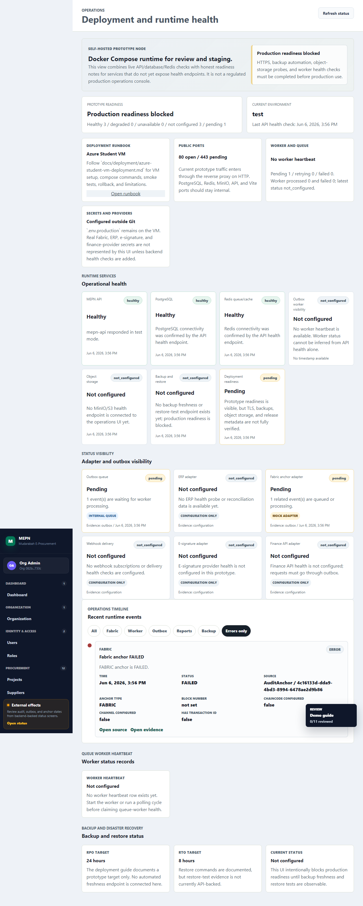

# Operations Timeline Evidence

## Status

Implemented for the reviewer delighter sprint.

The operations page now includes a backend/API-backed timeline of recent
runtime events. It summarizes worker heartbeat, outbox, reconciliation, Fabric
anchor, and report export records without rendering raw payload JSON, provider
credentials, secret material, or environment values.

## Source Evidence

| Area | Evidence |
|---|---|
| API DTO and sanitizer | `apps/api/src/modules/integrations/status/operations-timeline.dto.ts` |
| API endpoint | `GET /api/v1/integrations/timeline` |
| API service | `apps/api/src/modules/integrations/status/integration-status.service.ts` |
| Web UI | `apps/web/src/features/operations/OperationsTimeline.tsx` |
| E2E proof | `tests/e2e/24-operations-timeline.spec.ts` |
| Screenshot | `../uat/operations-timeline.png` |

## Verified Behavior

- Timeline reads backend records instead of frontend fixtures.
- Organization and actor context are required together for scoped reads.
- Active membership is required for scoped timeline access.
- Timeline items are sorted newest first and can be filtered by category or
  severity.
- Summaries include status and safe metadata only.
- Raw outbox payloads, reconciliation payloads, hash roots, secret-like fields,
  provider credentials, and runtime secret paths are not rendered.

## Verification Commands

```powershell
corepack pnpm --dir apps/api test:unit -- integration-status operations-timeline
corepack pnpm --dir apps/api test:integration -- outbox
corepack pnpm --dir apps/web test -- operations integrations
corepack pnpm test:e2e -- tests/e2e/24-operations-timeline.spec.ts
corepack pnpm lint
corepack pnpm typecheck
corepack pnpm build
```

Latest targeted result:

- API timeline unit tests: passed.
- API outbox/timeline integration test: passed.
- Web operations timeline tests: passed.
- Operations Timeline Playwright E2E: passed.
- Lint/typecheck/build: passed for implementation slices.

## Screenshot



## Known Limitations

- Timeline is a reviewer summary, not a full observability system.
- Deployment and backup timeline entries are limited to linked evidence until
  deployment/backup events are persisted as runtime records.
- External provider health is still represented by outbox/reconciliation
  evidence unless a real provider health endpoint exists.
