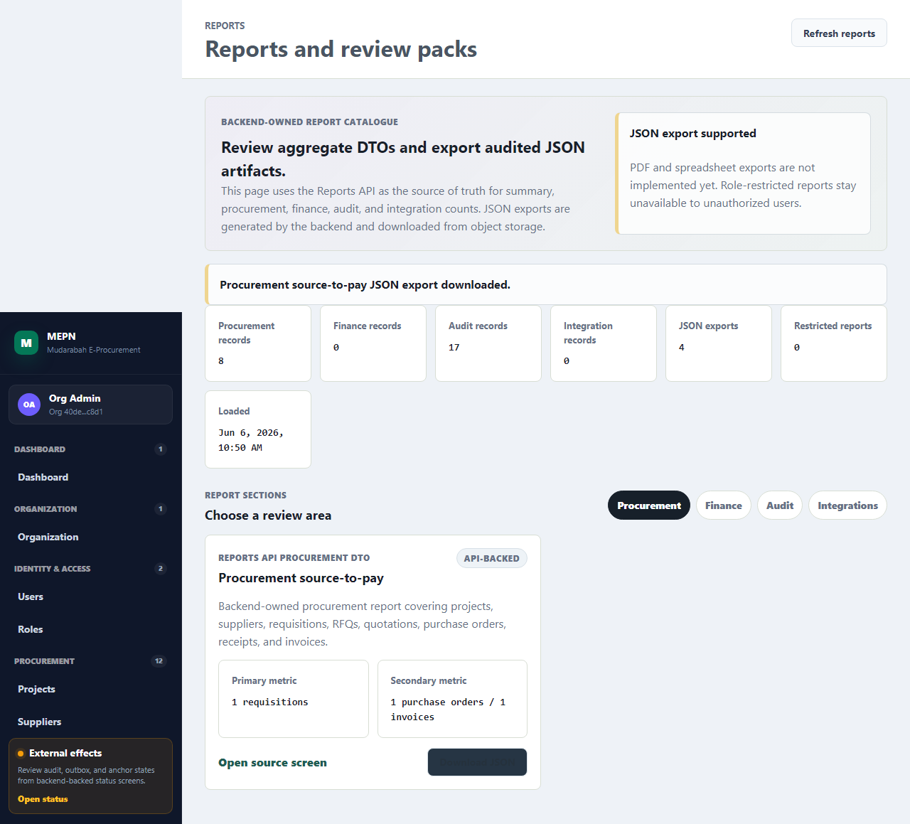

# Report DTO And JSON Export Evidence

## Status

Implemented for the current FYP review scope.

The reports module now provides backend-owned aggregate DTOs and audited JSON
exports for:

- procurement
- finance
- audit
- integrations

Unsupported formats remain explicit: PDF and spreadsheet exports are not
implemented.

## Source Evidence

| Area | Evidence |
|---|---|
| API module | `apps/api/src/modules/reports/` |
| Export model | `apps/api/prisma/schema.prisma` -> `ReportExportJob` |
| Migration | `apps/api/prisma/migrations/20260606003000_report_export_job/` |
| Frontend UI | `apps/web/src/features/reports/` |
| E2E proof | `tests/e2e/16-reports-export-flow.spec.ts` |
| Screenshot | `../uat/reports-json-export-flow.png` |

## API Endpoints

| Endpoint | Purpose |
|---|---|
| `GET /api/v1/reports/summary` | Organization-scoped report section totals and restricted section status. |
| `GET /api/v1/reports/procurement` | Procurement aggregate counts and status breakdowns. |
| `GET /api/v1/reports/finance` | Finance aggregate counts and status breakdowns. Requires a finance-capable role. |
| `GET /api/v1/reports/audit` | Audit event, hash record, and anchor counts. |
| `GET /api/v1/reports/integrations` | Outbox, reconciliation, webhook, and worker heartbeat counts. |
| `POST /api/v1/reports/exports` | Creates an export job, writes a JSON artifact, and audits request/completion/failure. |
| `GET /api/v1/reports/exports/:id` | Reads export job status with organization and role checks. |
| `GET /api/v1/reports/exports/:id/download` | Streams a completed JSON artifact and audits download. |

## Role And Safety Rules

- Active organization membership is required.
- Finance reports are restricted to finance-capable roles, Shariah reviewers,
  auditors, and organization admins.
- Procurement reports are restricted to procurement-capable roles, approvers,
  auditors, and organization admins.
- Export jobs preserve the same report access checks as the DTO endpoints.
- Exported JSON contains aggregate report DTO data, not PEM material, secrets,
  credentials, or confidential Fabric payloads.
- JSON export success is not treated as Fabric verification proof.

## Sanitized Export Shape

```json
{
  "exportJob": {
    "id": "<uuid>",
    "organizationId": "<organization-id>",
    "reportType": "procurement",
    "format": "json",
    "requestedByUserId": "<user-id>",
    "generatedAt": "<iso-date>"
  },
  "report": {
    "organizationId": "<organization-id>",
    "generatedAt": "<iso-date>",
    "counts": {
      "projects": 1,
      "suppliers": 1,
      "requisitions": 1,
      "purchaseOrders": 1,
      "invoices": 1,
      "total": 8
    }
  }
}
```

## Verification Commands

```powershell
corepack pnpm prisma:generate
corepack pnpm --dir apps/api test:unit -- reports
corepack pnpm --dir apps/api test:integration -- reports
corepack pnpm --dir apps/web test -- reports
corepack pnpm test:e2e -- tests/e2e/16-reports-export-flow.spec.ts
corepack pnpm lint
corepack pnpm typecheck
corepack pnpm build
```

Latest targeted result:

- API reports unit tests: passed.
- API reports integration tests: passed.
- Web reports model tests: passed.
- Reports Playwright E2E: passed.
- Lint/typecheck/build: passed.

## Screenshot



## Known Limitations

- JSON is the only implemented export format.
- PDF, spreadsheet, scheduled, and regulatory formatted report packs remain
  post-demo hardening.
- Exported reports are aggregate review artifacts; they are not automatically
  registered as evidence items yet.
- Closure-specific report packs remain covered by the finance closure workflow,
  not the generic reports module.
