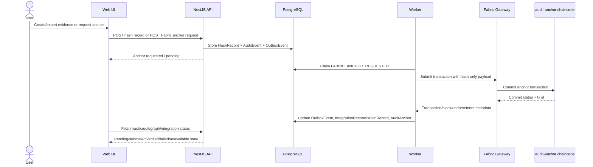
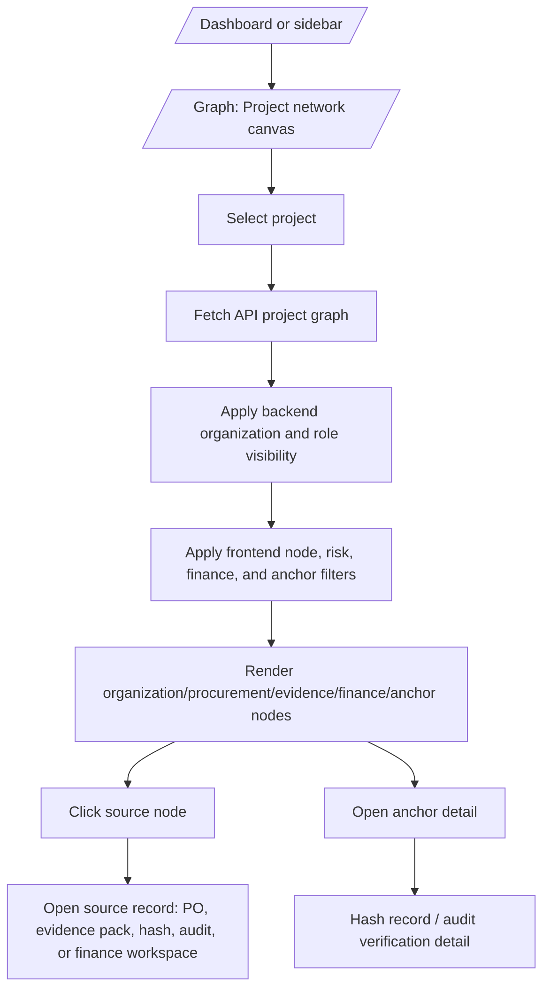
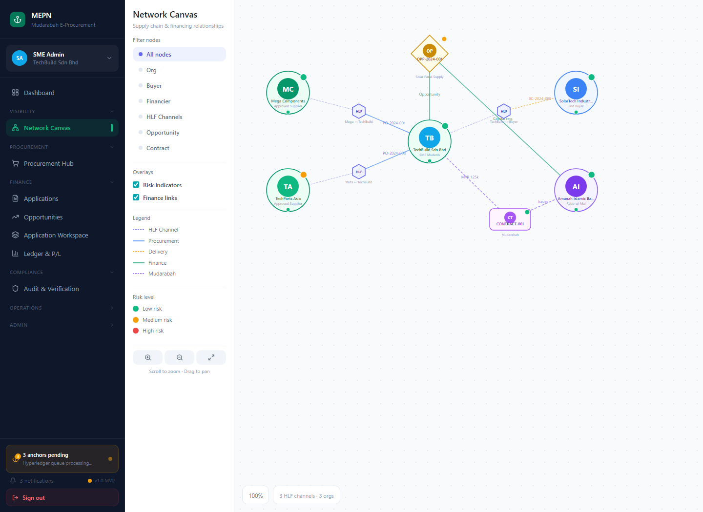
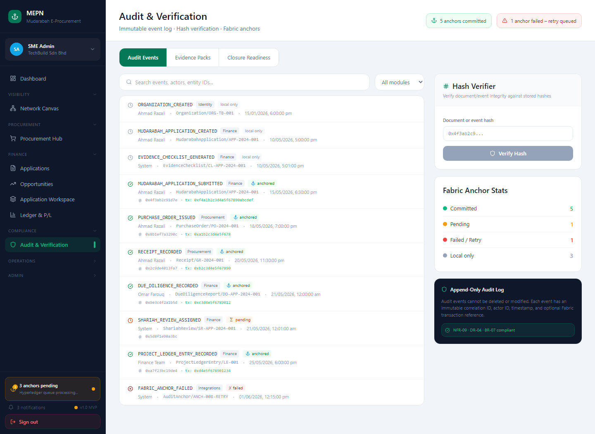

# Fabric Gateway, Graph UI, Testing, and UAT Integration Plan

Status: planning baseline  
Target branch: `main`  
Created for: MEPN/FYP repository  
Primary implementation areas:

- `apps/api/src/modules/integrations/fabric/`
- `apps/worker/src/integrations/`
- `apps/api/src/modules/evidence/hash-records/`
- `apps/api/src/modules/graph/`
- `apps/web/src/features/graph/`
- `apps/web/src/features/audit/`
- `apps/web/src/features/evidence/`
- `apps/web/src/features/integrations/`
- `docs/ui/assets/`

## 1. Current repository baseline

### 1.1 Fabric baseline

The repository already has a Fabric-shaped integration boundary, but it is intentionally mock-backed.

Current source evidence:

- `README.md`, section `Known Limitations`, states: “Fabric anchoring is represented through honest status states; real Fabric Gateway integration is not complete.”
- `docs/adr/ADR-012-integration-boundary.md`, section `Decision`, states: “Fabric starts with mock anchoring only.” It also states that hash records enqueue `FABRIC_ANCHOR_REQUESTED`, and the worker stores an `AuditAnchor` with `ANCHORED_MOCK` and a fake transaction reference.
- `apps/api/src/modules/integrations/fabric/fabric-anchor.service.ts` currently creates a durable outbox event named `FABRIC_ANCHOR_REQUESTED` with `integrationType: 'FABRIC'`, `canonicalHash`, entity details, timestamp, and an idempotency key.
- `apps/api/src/modules/integrations/fabric/mock-fabric-anchor.adapter.ts` returns mock fields such as `fabricTransactionId: mock-tx-*`, `fabricBlockNumber`, and `status: 'ANCHORED_MOCK'`.
- `apps/worker/src/integrations/mock-adapters.ts` dispatches `FABRIC_ANCHOR_REQUESTED` to a mock Fabric result and returns `integrationType: 'FABRIC'`, `externalReference: mock-tx-*`, and `status: 'ANCHORED_MOCK'`.
- `apps/worker/src/outbox/outbox-worker.service.ts` stores integration reconciliation records and creates `AuditAnchor` rows with `anchorType: 'FABRIC_MOCK'` and `status: 'ANCHORED_MOCK'`.
- `apps/api/prisma/schema.prisma` already has `HashRecord`, `AuditAnchor`, `OutboxEvent`, and `IntegrationReconciliationRecord` models.
- `.env.production.example` already has placeholder variables: `FABRIC_ENABLED=false`, `FABRIC_GATEWAY_URL=`, `FABRIC_CHANNEL=`, and `FABRIC_CHAINCODE=`.
- `apps/api/package.json` and `apps/worker/package.json` do not currently include a Hyperledger Fabric Gateway SDK dependency.

Design requirements already documented:

- `docs/requirements/mudarabah_eprocurement_srs.tex` requires selected audit events to be anchored to Fabric by writing event hashes, organization identifiers, timestamps, and transaction references to approved channel chaincode (`FR-48`).
- The same SRS requires queueing and retrying Fabric anchoring events when the gateway is unavailable (`FR-49`) and verification against stored hash plus Fabric transaction reference (`FR-50`).
- `IR-08` requires the Fabric adapter to connect to an approved gateway endpoint using organization identity material and channel configuration.
- `IR-09` requires submitting proposals to configured chaincode and recording transaction IDs, block references, and endorsement status.
- `DR-05` requires only cryptographic hashes and minimum required metadata on Fabric unless private data collection rules explicitly permit more.
- `NFR-12` requires local procurement to continue when Fabric is unavailable with clear pending-anchor indication.
- `docs/technology-stack.md` names the intended future stack as “Hyperledger Fabric Gateway SDK for Node.js” and “Go chaincode for audit anchors.”

### 1.2 Graph UI baseline

The graph feature under `apps/web/src/features/graph/` is already partially integrated as a read-only project graph/canvas.

Current source evidence:

- `apps/web/src/app/router.tsx` routes `/graph/projects` to `GraphRoute` through `GraphRouteAdapter`.
- `apps/web/src/features/graph/GraphRoute.tsx` loads projects, fetches a project graph, applies role and view filters, shows project/node/risk controls, displays node/edge counts, and renders a custom SVG/HTML graph canvas.
- `apps/web/src/features/graph/api/useProjectGraph.ts` calls `endpoints.graph.project(projectId, organizationId, actorUserId)` and requires an active organization session.
- `apps/web/src/features/graph/model/networkGraph.types.ts` already defines a graph relationship type `anchors`.
- `apps/web/src/features/graph/model/networkGraph.model.ts` maps API graph data into a frontend graph model, hides finance nodes by role, filters by node type/risk/finance layer, summarizes graph risk/visibility, and maps labels containing `anchor` to relationship `anchors`.
- `apps/api/src/modules/graph/graph.controller.ts` exposes `GET /graph/projects/:projectId`.
- `apps/api/src/modules/graph/graph.service.ts` builds a graph from real project, procurement, evidence, and finance records, and hides finance records when the actor role does not allow them.
- `apps/web/src/features/graph/model/networkGraph.model.test.ts` already covers mapping, role filtering, view filtering, and summary behavior.
- `apps/api/test/integration/graph.integration.spec.ts` already checks that real records produce a project graph and that procurement-only actors do not receive finance nodes.
- `tests/e2e/12-read-only-project-graph.spec.ts` already describes the intended browser workflow for source navigation and finance-node hiding.

### 1.3 Screenshot and UI documentation baseline

Existing screenshot documentation can be reused as the baseline for the UI-flow plan.

Current screenshot references:

- `docs/ui/current-vs-figma-web-ui-workflow.md` embeds `docs/ui/assets/current-screen-10-project-graph.png` for the current project graph.
- The same document embeds `docs/ui/assets/current-screen-11-integrations.png` for the current integrations screen.
- It embeds `docs/ui/assets/figma-make-screen-10-network-canvas.png` for the Figma Make network canvas reference.
- It embeds `docs/ui/assets/figma-make-screen-12-audit-verification.png` for the Figma Make audit verification reference.

## 2. Target architecture

The target is to move from mock Fabric anchoring to real Fabric Gateway anchoring while preserving the existing local/off-chain evidence model.

### 2.1 Non-negotiable design rules

1. PostgreSQL remains the operational source of truth.
2. Fabric stores hashes, minimal metadata, transaction references, and verification references only.
3. Full procurement payloads, contracts, bank details, invoices, quotations, documents, and confidential evidence stay off-chain by default.
4. Fabric failures must not block local procurement, evidence, or finance workflows.
5. All Fabric effects must remain outbox-driven, idempotent, retryable, and reconcilable.
6. The mock adapter must remain available for local/dev/demo mode.
7. The graph UI must not show a verified Fabric state unless the backend has real verification evidence.
8. Screenshots used for documentation and UAT must be captured from the production React routes, not from local-only fixture states.

### 2.2 Target Fabric runtime flow



### 2.3 Target graph UI flow



## 3. UI flow with screenshot references

These screenshots are already in the repository and should remain the baseline visual evidence until Phase 9 captures the new Fabric-specific screenshots.

### 3.1 Current project graph baseline


Use this as the baseline for `apps/web/src/features/graph/GraphRoute.tsx`. The future work should add anchor-aware nodes, edges, filters, and badges without losing the existing project selector, node/risk filter, finance-layer toggle, hidden-by-role summary, and source-record links.

### 3.2 Current integrations baseline


Use this as the baseline for Fabric Gateway health, outbox, reconciliation, and retry visibility. The existing “Mock Fabric anchor” action should become either a dev-only action or a mode-aware action showing `mock` versus `gateway` backend mode.

### 3.3 Figma Make network canvas reference



Use this as visual direction only. Do not copy local mock state or fake success states. Production graph state must come from backend project graph, hash records, audit anchors, and reconciliation records.

### 3.4 Figma Make audit verification reference



Use this as visual direction for reviewer-facing verification language, but real verification must come from hash comparison and Fabric transaction/chaincode evidence.

### 3.5 New screenshots to capture during implementation

Phase 9 must add these files under `docs/ui/assets/` and update this plan or a follow-up UI-flow document:

| Screenshot | Route | Purpose |
|---|---|---|
| `fabric-graph-flow-01-create-hash-record.png` | `/evidence/hashes` | Show creating a canonical hash and pending anchor status. |
| `fabric-graph-flow-02-hash-detail-pending.png` | `/evidence/hashes/:id` | Show pending or retrying Fabric status before commit. |
| `fabric-graph-flow-03-integrations-gateway-health.png` | `/integrations` | Show Gateway configured/healthy/degraded and outbox state. |
| `fabric-graph-flow-04-project-graph-anchor-overlay.png` | `/graph/projects` | Show anchor node/edge/status overlay on project graph. |
| `fabric-graph-flow-05-audit-verification-verified.png` | `/audit` or `/audit/entity/:entityType/:entityId` | Show verified hash plus real Fabric transaction reference. |
| `fabric-graph-flow-06-role-filtered-graph.png` | `/graph/projects` as procurement-only user | Show finance/anchor visibility according to role rules. |

Recommended capture method:

```ts
await page.screenshot({
  path: 'docs/ui/assets/fabric-graph-flow-04-project-graph-anchor-overlay.png',
  fullPage: true,
});
```

## 4. Phased implementation plan

Each phase starts with current progress and objective, then gives implementation direction, references, planned commit work, and exit criteria.

---

## Phase 0 - Planning baseline and source-of-truth alignment

### Current progress and objective

Current progress: the repository already has SRS, SDD, ADRs, mock Fabric anchoring, graph read model, graph UI, and testing foundations.  
Objective: preserve the source-of-truth order and prevent Fabric/graph work from becoming ad hoc UI-only or mock-only implementation.

### Implementation direction

1. Keep `docs/requirements/mudarabah_eprocurement_srs.tex` and `docs/design/mepn_software_design_description.tex` as authority for requirements and architecture.
2. Keep `docs/adr/ADR-012-integration-boundary.md` as the accepted reason that current Fabric is mock-only.
3. Add a new ADR before real Fabric work begins. Suggested path: `docs/adr/ADR-014-real-fabric-gateway-anchoring.md`.
4. Add a work item in `docs/roadmap/module-roadmap.md` under Integrations and Graph/Canvas if traceability is required by reviewers.
5. Keep `apps/web/src/features/graph/` as production UI code. Do not import or copy from `docs/design/figma-make-reference/prototype-src/`.

### Detailed references

- `README.md` -> `Known Limitations`
- `docs/adr/ADR-012-integration-boundary.md`
- `docs/implementation-plan.md` -> `Slice 8: Audit and Fabric verification`, `Slice 9: Network canvas`, `Slice 10: Integrations, Operations, Admin, and Reports`
- `docs/roadmap/module-roadmap.md` -> `Graph/Canvas`, `Integrations`, `Evidence and Audit`

### Commit work

Commit message for this phase:

```text
docs(roadmap): add fabric graph ui testing plan
```

### Exit criteria

- A single planning document exists and is referenced by future issues/PRs.
- Fabric, graph, testing, UAT, and screenshot work are traceable to source files and requirements.

---

## Phase 1 - Fabric Gateway architecture, configuration, and ADR

### Current progress and objective

Current progress: `.env.production.example` has Fabric placeholders, but the API/worker packages do not have Fabric Gateway SDK dependencies and there is no real Gateway configuration contract.  
Objective: define the real Fabric configuration surface, feature-flag behavior, and adapter replacement strategy before writing the Gateway adapter.

### Implementation direction

1. Create `docs/adr/ADR-014-real-fabric-gateway-anchoring.md`.
2. Define whether the first real integration uses:
   - an external Fabric Gateway operated by a consortium/operator, or
   - a local Fabric test network for development only.
3. Extend `.env.production.example` with explicit variables:
   - `FABRIC_ENABLED`
   - `FABRIC_MODE=mock|gateway`
   - `FABRIC_GATEWAY_URL`
   - `FABRIC_MSP_ID`
   - `FABRIC_CHANNEL`
   - `FABRIC_CHAINCODE`
   - `FABRIC_IDENTITY_CERT_PATH` or secret reference
   - `FABRIC_PRIVATE_KEY_PATH` or secret reference
   - `FABRIC_TLS_CERT_PATH`
   - `FABRIC_PEER_ENDPOINT`
   - `FABRIC_GATEWAY_HOST_ALIAS`
   - `FABRIC_SUBMIT_TIMEOUT_MS`
   - `FABRIC_COMMIT_TIMEOUT_MS`
4. Add config readers:
   - `apps/api/src/config/fabric-env.ts` if the API needs configuration/health display.
   - `apps/worker/src/config/fabric-env.ts` for the worker-side submit path.
5. Keep `FABRIC_ENABLED=false` and mock mode as default for local dev.
6. Document the security boundary: Fabric payloads contain hashes and minimal metadata only.

### Detailed references

- `.env.production.example` currently contains the Fabric placeholders.
- `docs/requirements/mudarabah_eprocurement_srs.tex` -> `IR-08`, `IR-09`, `DR-05`, `NFR-18`.
- `docs/design/mepn_software_design_description.tex` -> Security Architecture states that confidential payloads are off-chain and Fabric receives hashes/minimum metadata only.
- `docs/technology-stack.md` -> Fabric Gateway SDK and Go chaincode decisions.

### Commit work

Recommended commits:

```text
docs(adr): define real fabric gateway anchoring
feat(config): add fabric gateway environment contract
```

### Exit criteria

- ADR accepted.
- Environment contract documented and validated.
- Mock mode remains the default.
- Real mode cannot start without required identity/channel/chaincode configuration.

---

## Phase 2 - Fabric chaincode and local test network foundation

### Current progress and objective

Current progress: the repository has no chaincode, no Fabric peer/orderer/CA services, and no Fabric dev profile. The SRS explicitly leaves channel topology, endorsement policy, and private data collection requirements open.  
Objective: add the minimum chaincode and local test-network scaffolding needed to validate real anchor submission without changing the business workflow.

### Implementation direction

1. Add chaincode under a clear path such as:

```text
chaincode/audit-anchor-go/
```

2. Implement Go chaincode with minimal functions:

```text
CreateAnchor(anchorId, organizationId, entityType, entityId, canonicalHash, timestamp, idempotencyKey, metadataJson)
ReadAnchor(anchorId)
FindAnchorByHash(canonicalHash)
AnchorExists(anchorId)
```

3. Store only these fields on-chain:
   - `anchorId`
   - `organizationId` or a non-sensitive organization reference
   - `entityType`
   - `entityId` only if approved as non-sensitive; otherwise store an entity reference hash
   - `canonicalHash`
   - `hashAlgorithm`
   - `timestamp`
   - `idempotencyKey`
   - optional metadata hash
4. Emit a chaincode event such as `AuditAnchorCreated`.
5. Add a dev-only Fabric network direction:

```text
infra/fabric/README.md
infra/fabric/docker-compose.fabric.yml
infra/fabric/scripts/up.sh
infra/fabric/scripts/deploy-chaincode.sh
infra/fabric/scripts/down.sh
```

6. Keep the production Docker Compose free from peer/orderer/CA services unless the ADR explicitly decides self-hosted Fabric for SMEs. For production, prefer external Gateway configuration through environment variables.
7. Decide whether private data collections are required before adding any non-hash metadata.

### Detailed references

- `docs/requirements/mudarabah_eprocurement_srs.tex` -> open issue `OI-05`, which asks to define Fabric channel topology, endorsement policies, and private data collection need.
- `docs/design/mepn_software_design_description.tex` -> open question `OQ-04`, which asks who operates peers, orderers, CA/MSP, and chaincode lifecycle.
- `docs/technology-stack.md` -> “Fabric chaincode | Go chaincode for audit anchors.”

### Commit work

Recommended commits:

```text
feat(fabric): add audit anchor chaincode contract
chore(fabric): add local fabric test network scaffolding
```

### Exit criteria

- Chaincode can be built independently.
- Local dev network can be started and stopped without affecting normal `infra/docker-compose.yml`.
- Chaincode stores hash-only anchor records.
- Chaincode API supports idempotent anchor creation and read/query verification.

---

## Phase 3 - Worker-side real Fabric Gateway adapter

### Current progress and objective

Current progress: the worker currently dispatches `FABRIC_ANCHOR_REQUESTED` through `MockIntegrationAdapters`, which returns fake transaction references. The API-side `FabricAnchorAdapter` type already defines a `FabricAnchorResult` that includes `fabricTransactionId`, `fabricBlockNumber`, and status.  
Objective: add a real Gateway adapter behind a mode switch while preserving mock mode.

### Implementation direction

1. Add a worker-side adapter interface if one is not already shared:

```text
apps/worker/src/integrations/fabric/fabric-anchor.adapter.ts
apps/worker/src/integrations/fabric/mock-fabric-anchor.adapter.ts
apps/worker/src/integrations/fabric/fabric-gateway-anchor.adapter.ts
apps/worker/src/integrations/integration-adapter-registry.ts
```

2. Add dependency to `apps/worker/package.json`:

```text
@hyperledger/fabric-gateway
```

3. Keep dependency out of `apps/api/package.json` unless the API needs direct Fabric health/query calls. Prefer worker-only submission and API-only status/query endpoints.
4. Implement `FabricGatewayAnchorAdapter.anchor(input)`:
   - load identity certificate and private key from configured secret paths or secret manager abstraction;
   - create gRPC client and Gateway connection;
   - select `channel` and `chaincode`;
   - submit `CreateAnchor` transaction with hash-only payload;
   - record transaction ID, commit status, block reference if available, endorsement/commit metadata, gateway endpoint, channel, and chaincode;
   - return `status: 'ANCHORED'` only after commit confirmation.
5. Replace hard-coded mock dispatch with registry selection:

```text
if FABRIC_MODE=mock -> MockFabricAnchorAdapter
if FABRIC_MODE=gateway -> FabricGatewayAnchorAdapter
```

6. Preserve existing outbox retry behavior in `apps/worker/src/outbox/outbox-worker.service.ts`.
7. Classify Fabric failures:
   - transient gateway unavailable -> retry;
   - endorsement timeout -> retry with bounded attempts;
   - chaincode validation error -> fail with clear error;
   - identity/certificate error -> fail and mark configuration issue;
   - duplicate/idempotency match -> reconcile as already anchored if hash and idempotency key match.

### Detailed references

- `apps/worker/src/integrations/mock-adapters.ts` -> current mock dispatch path.
- `apps/worker/src/outbox/outbox-worker.service.ts` -> current claim/process/retry/store flow.
- `apps/api/src/modules/integrations/fabric/fabric-anchor.adapter.ts` -> current API-side result shape.
- `apps/api/prisma/schema.prisma` -> `AuditAnchor`, `OutboxEvent`, and `IntegrationReconciliationRecord`.
- `docs/adr/ADR-012-integration-boundary.md` -> external integrations are unreliable and should use adapters, durable outbox events, idempotency, retry state, and reconciliation records.

### Commit work

Recommended commits:

```text
feat(worker): add real fabric gateway anchor adapter
refactor(worker): route integration events through adapter registry
```

### Exit criteria

- Mock mode continues to pass existing tests.
- Gateway mode can submit a real Fabric transaction against local test network.
- Worker stores real transaction metadata in reconciliation and anchor records.
- Failed Gateway calls use existing retry behavior and do not block local workflow.

---

## Phase 4 - Database and API status model for real Fabric metadata

### Current progress and objective

Current progress: `AuditAnchor` stores `anchorType`, `status`, `rootHash`, generic `metadata`, and `anchoredAt`. Reconciliation stores `externalReference`, `status`, request payload, response payload, and attempts.  
Objective: make real Fabric transaction metadata first-class enough for audit, graph, UAT, and reviewer evidence without duplicating confidential data.

### Implementation direction

1. Decide whether to extend `AuditAnchor` with explicit fields or keep all Fabric-specific data in `metadata` and `IntegrationReconciliationRecord.responsePayload`.
2. Recommended schema extension:

```prisma
model AuditAnchor {
  // existing fields...
  anchorType              String    @default("LOCAL")
  status                  String    @default("PENDING")
  rootHash                String
  fabricTransactionId     String?
  fabricBlockNumber       Int?
  fabricChannel           String?
  fabricChaincode         String?
  fabricCommitStatus      String?
  fabricEndorsementStatus String?
}
```

3. Add a migration after confirming field names.
4. Update anchor creation in `apps/worker/src/outbox/outbox-worker.service.ts`:
   - `FABRIC_MOCK` with `ANCHORED_MOCK` in mock mode;
   - `FABRIC` with `ANCHORED` in Gateway mode;
   - `FAILED` or `PENDING` statuses only if worker is explicitly storing failed/pending anchors.
5. Add read endpoints for status details:

```text
GET /api/v1/hash-records/:id
GET /api/v1/hash-records/:id/verify
GET /api/v1/integrations/outbox/:id
GET /api/v1/integrations/reconciliation
GET /api/v1/audit-events?entityType=...&entityId=...
```

6. Add a Fabric verification endpoint only after chaincode query is implemented:

```text
GET /api/v1/hash-records/:id/fabric-verification
```

Return:

```json
{
  "hashRecordId": "...",
  "canonicalHash": "...",
  "localHashValid": true,
  "fabricAnchorFound": true,
  "fabricTransactionId": "...",
  "fabricBlockNumber": 123,
  "fabricChannel": "...",
  "fabricChaincode": "...",
  "status": "VERIFIED"
}
```

### Detailed references

- `apps/api/prisma/schema.prisma` -> existing data model.
- `apps/api/src/modules/evidence/hash-records/hash-records.service.ts` -> current hash creation, outbox enqueueing, and local anchor status lookup.
- `apps/api/src/modules/integrations/status/integration-status.service.ts` -> current outbox/reconciliation read model.
- `apps/web/src/features/audit/verification/auditVerification.model.ts` -> current frontend normalization for `ANCHORED_MOCK`, `ANCHORED`, pending, failed, and unavailable.

### Commit work

Recommended commits:

```text
feat(db): add real fabric anchor metadata fields
feat(api): expose fabric verification status for hash records
```

### Exit criteria

- Hash detail responses can distinguish mock, pending, real anchored, verified, failed, and unavailable.
- No full confidential payload is stored on-chain or in public UI fields.
- Reconciliation records remain the operational source for adapter attempts and errors.

---

## Phase 5 - Evidence, audit, and hash verification workflow

### Current progress and objective

Current progress: hash creation already enqueues a Fabric anchor request, and hash verification recomputes local hash state. The audit UI already displays hash and anchor fields when metadata is present.  
Objective: connect real Fabric transaction verification to evidence/hash/audit screens and make reviewer evidence downloadable.

### Implementation direction

1. Update `HashRecordsService.anchorStatusFor()` so it returns richer status:
   - `NOT_REQUESTED`
   - `ANCHOR_REQUESTED`
   - `ANCHORED_MOCK`
   - `ANCHORED`
   - `VERIFIED`
   - `FAILED`
   - `FABRIC_UNAVAILABLE`
2. Add a server-side verification method that:
   - recomputes local canonical hash;
   - queries Fabric chaincode by `canonicalHash` or `anchorId`;
   - confirms the on-chain hash equals the local canonical hash;
   - confirms transaction metadata is present;
   - returns a reviewer-safe verification result.
3. Update frontend hash detail in `apps/web/src/features/evidence/EvidenceRoute.tsx`:
   - rename “Mock Fabric anchor” panel dynamically based on `anchorType`;
   - show transaction ID, block number, channel, chaincode, and verification result when real;
   - preserve mock wording in mock mode.
4. Update audit model in `apps/web/src/features/audit/verification/auditVerification.model.ts`:
   - treat `ANCHORED` + matching hash/transaction reference as `verified`;
   - treat `ANCHORED_MOCK` as `submitted`, never as verified;
   - show a clear note if Fabric is unavailable.
5. Add downloadable verification evidence:

```text
GET /api/v1/hash-records/:id/verification-report.json
```

Optional later:

```text
GET /api/v1/hash-records/:id/verification-report.pdf
```

### Detailed references

- `apps/api/src/modules/evidence/hash-records/hash-records.service.ts`
- `apps/api/src/modules/evidence/hash-records/hash-records.controller.ts`
- `apps/web/src/features/evidence/EvidenceRoute.tsx`
- `apps/web/src/features/audit/AuditScreen.tsx`
- `apps/web/src/features/audit/verification/auditVerification.model.ts`
- `docs/implementation-plan.md` -> Slice 8 acceptance criterion: users distinguish pending, verified, failed, and unavailable states.

### Commit work

Recommended commits:

```text
feat(evidence): verify hash records against fabric anchors
feat(audit): show real fabric verification evidence
```

### Exit criteria

- A reviewer can open a hash record and see local hash validity plus real/mock/pending Fabric state.
- `ANCHORED_MOCK` is never labeled as verified.
- Real Fabric transaction data is visible only after Gateway commit/query evidence exists.

---

## Phase 6 - Graph UI integration for Fabric anchors

### Current progress and objective

Current progress: `apps/web/src/features/graph/` already renders a project graph and already has a relationship type `anchors`, but the backend graph service does not yet include hash records or audit anchors as graph nodes/edges.  
Objective: integrate Fabric anchor visibility into the existing graph UI so reviewers can see which evidence/procurement records are anchored, pending, failed, or verified.

### Implementation direction

1. Extend backend graph query in `apps/api/src/modules/graph/graph.service.ts`:
   - include `HashRecord` rows for project-related entities;
   - include latest `AuditAnchor` by hash/root hash;
   - include `IntegrationReconciliationRecord` or outbox status for pending/failed anchors;
   - include anchor nodes only when the actor role is authorized.
2. Add graph node types in `apps/web/src/features/graph/model/networkGraph.types.ts`:

```ts
export type NetworkNodeType =
  | 'organization'
  | 'supplier'
  | 'buyer'
  | 'financier'
  | 'opportunity'
  | 'application'
  | 'document'
  | 'anchor'
  | 'hash_record'
```

3. Add anchor relationships:

```ts
export type NetworkRelationship =
  | 'supplies'
  | 'buys_from'
  | 'finances'
  | 'supports'
  | 'evidences'
  | 'anchors'
  | 'verifies'
```

4. Map backend entities:
   - `HashRecord` -> `hash_record` node;
   - `AuditAnchor` -> `anchor` node;
   - `HashRecord` to source entity -> `verifies` edge;
   - `AuditAnchor` to `HashRecord` -> `anchors` edge;
   - failed/pending outbox event to `HashRecord` -> optional `supports` or `anchors` edge with status.
5. Add UI controls in `GraphRoute.tsx`:
   - `Show anchor layer` checkbox;
   - `Anchor status` filter: all, pending, submitted, verified, failed, unavailable, mock;
   - summary card for anchored, pending, failed, hidden by role.
6. Update node rendering:
   - anchor nodes display transaction ID or `pending`/`failed` state;
   - mock anchors display `Mock` status;
   - verified anchors display real transaction/block reference.
7. Add source links:
   - `HashRecord` -> `/evidence/hashes/:id`
   - `AuditAnchor` -> `/audit/entity/HashRecord/:hashRecordId` or hash detail if available
   - outbox/reconciliation -> `/integrations` or future `/integrations/outbox/:id`
8. Keep role-based filtering:
   - auditors, organization admins, finance accountants, financiers, and Shariah reviewers can see anchor layer;
   - procurement users can see anchor status for procurement records but not restricted finance details;
   - suppliers/counterparties should not see private graph details unless explicitly scoped.
9. Fix the E2E route-heading mismatch if still present: `tests/e2e/12-read-only-project-graph.spec.ts` expects `Project network canvas`, while `GraphRoute.tsx` currently renders `Network canvas cockpit`.

### Detailed references

- `apps/web/src/features/graph/GraphRoute.tsx` -> current graph toolbar, summary, and renderer.
- `apps/web/src/features/graph/model/networkGraph.types.ts` -> existing `anchors` relationship.
- `apps/web/src/features/graph/model/networkGraph.model.ts` -> existing role filtering and relationship mapping.
- `apps/api/src/modules/graph/graph.service.ts` -> current API graph read model.
- `docs/roadmap/module-roadmap.md` -> Graph/Canvas scope and Integrations scope.
- `docs/implementation-plan.md` -> Slice 9 acceptance criteria for permission-filtered graph data.

### Commit work

Recommended commits:

```text
feat(api): add fabric anchor nodes to project graph
feat(web): add anchor layer filters to graph canvas
fix(e2e): align project graph heading assertion
```

### Exit criteria

- Project graph can show anchor/hash status for evidence-backed project records.
- Graph filters do not leak restricted finance nodes or hidden edges.
- Clicking anchor/hash nodes opens reviewer-appropriate source screens.
- E2E graph workflow passes for admin/auditor and procurement-only actors.

---

## Phase 7 - Integrations and operations UI for Fabric Gateway mode

### Current progress and objective

Current progress: the integrations page lists outbox, reconciliation, webhook subscription state, and status cards. The Fabric status card currently falls back to “Fabric Gateway health is not configured; local workflows continue.”  
Objective: expose real Fabric Gateway health and mode-aware actions while keeping mock mode honest.

### Implementation direction

1. Add API health endpoint:

```text
GET /api/v1/integrations/fabric/status
```

Return:

```json
{
  "enabled": true,
  "mode": "gateway",
  "gatewayConfigured": true,
  "channel": "mepn-audit",
  "chaincode": "audit_anchor",
  "lastProbeStatus": "healthy",
  "lastProbeAt": "...",
  "message": "Gateway reachable and chaincode query succeeded"
}
```

2. Add worker probe or API probe depending on ADR decision. Prefer API probe only if it can safely read config/identity. Otherwise expose last worker probe from database.
3. Update `apps/web/src/features/integrations/status/integrationStatus.model.ts`:
   - classify Fabric as `healthy` only with a real Gateway probe or recent successful real reconciliation;
   - classify mock mode as `pending` or `not_configured`, not production-ready;
   - show failed outbox/reconciliation as degraded.
4. Update `apps/web/src/features/integrations/IntegrationsRoute.tsx`:
   - rename “Mock Fabric anchor” to mode-aware `Fabric anchor request`;
   - show mode badge: mock, gateway, disabled;
   - hide manual anchor request unless role permits it;
   - add link to Fabric configuration docs.
5. Update operations screen if Fabric becomes part of operational readiness.

### Detailed references

- `apps/web/src/features/integrations/status/integrationStatus.model.ts`
- `apps/web/src/features/integrations/IntegrationsRoute.tsx`
- `apps/api/src/modules/integrations/status/integration-status.controller.ts`
- `apps/api/src/modules/integrations/status/integration-status.service.ts`
- `docs/implementation-plan.md` -> Slice 10 integrations and operations status.

### Commit work

Recommended commits:

```text
feat(api): expose fabric gateway integration health
feat(web): show mode-aware fabric integration status
```

### Exit criteria

- `/integrations` distinguishes disabled, mock, configured gateway, degraded gateway, and failed outbox states.
- Production readiness remains blocked when Fabric is expected but not configured.
- Local workflows still continue when Fabric is unavailable.

---

## Phase 8 - Unit testing plan

### Current progress and objective

Current progress: graph model unit tests already exist. Mock Fabric behavior is covered by worker integration tests but not by fine-grained unit tests for real adapter behavior.  
Objective: add deterministic unit tests for Fabric configuration, adapter selection, payload construction, graph anchor mapping, and UI status normalization.

### Unit test scope

#### Fabric config tests

Add tests for:

- `FABRIC_ENABLED=false` -> mock/disabled behavior.
- `FABRIC_MODE=gateway` without required config -> validation error.
- identity/cert/key path parsing.
- timeout defaults.
- no accidental storage of forbidden fields.

Suggested files:

```text
apps/worker/src/config/fabric-env.spec.ts
apps/api/src/config/fabric-env.spec.ts
```

#### Fabric payload tests

Add tests for:

- `FabricGatewayAnchorAdapter` builds hash-only chaincode payload.
- payload excludes supplier bank details, document body, invoice contents, and full canonical JSON.
- idempotency key is stable.
- duplicate chaincode response maps to reconciled/anchored status if hash matches.

Suggested files:

```text
apps/worker/src/integrations/fabric/fabric-gateway-anchor.adapter.spec.ts
apps/worker/src/integrations/fabric/fabric-anchor-payload.spec.ts
```

#### Worker adapter registry tests

Add tests for:

- mock mode selects mock adapter;
- gateway mode selects real adapter;
- disabled mode records unavailable/pending without fake success;
- dispatch preserves existing ERP/e-sign/finance/webhook behavior.

Suggested files:

```text
apps/worker/src/integrations/integration-adapter-registry.spec.ts
```

#### Audit/evidence UI model tests

Add tests for:

- `ANCHORED_MOCK` maps to submitted, not verified;
- `ANCHORED` + hash + transaction ID maps to verified;
- failed outbox maps to failed;
- unavailable maps to unavailable;
- verification note text is safe and accurate.

Existing file to extend:

```text
apps/web/src/features/audit/verification/auditVerification.model.test.ts
```

#### Graph model tests

Extend existing tests to cover:

- `HashRecord` maps to `hash_record` node;
- `AuditAnchor` maps to `anchor` node;
- anchor status filter hides unrelated anchors;
- role filter removes hidden anchor edges when endpoints are hidden;
- `anchors` and `verifies` relationships are summarized correctly.

Existing file to extend:

```text
apps/web/src/features/graph/model/networkGraph.model.test.ts
```

### Commands

```bash
corepack pnpm --dir apps/web test:unit
corepack pnpm --dir apps/api test:unit
corepack pnpm --dir apps/worker test:unit
corepack pnpm test:unit
```

### Commit work

Recommended commits:

```text
test(fabric): add gateway config and payload unit tests
test(graph): cover fabric anchor graph mapping
```

### Exit criteria

- Unit tests fail if mock anchors are labeled verified.
- Unit tests fail if Fabric payload contains full confidential payloads.
- Graph model tests prove hidden edges are pruned when anchor endpoints are hidden.

---

## Phase 9 - Integration testing plan

### Current progress and objective

Current progress: the repository has integration tests for mock Fabric anchor worker behavior, worker retry policy, and graph read model from real database records.  
Objective: add integration tests that prove real Fabric Gateway mode works against a local test network and that API/UI read models reflect real transaction metadata.

### Integration test scope

#### Worker + mock mode regression

Keep and extend:

```text
apps/worker/test/integration/mock-fabric-anchor.integration.spec.ts
apps/worker/test/integration/retry-policy.integration.spec.ts
```

Add assertions:

- mock transaction never becomes `VERIFIED`;
- `AuditAnchor.anchorType` remains `FABRIC_MOCK` in mock mode;
- reconciliation response payload contains mock-only marker.

#### Worker + real Fabric test network

Add tests behind a feature flag so CI can skip if Fabric is not available:

```text
apps/worker/test/integration/fabric-gateway-anchor.integration.spec.ts
```

Test flow:

1. Start PostgreSQL and local Fabric test network.
2. Deploy audit anchor chaincode.
3. Insert `FABRIC_ANCHOR_REQUESTED` outbox event.
4. Run worker once.
5. Assert outbox is `COMPLETED`.
6. Assert reconciliation is `ANCHORED`.
7. Assert `AuditAnchor.anchorType='FABRIC'` and real transaction metadata exists.
8. Query chaincode and assert hash exists on-chain.

#### API hash verification integration

Add tests:

```text
apps/api/test/integration/hash-record-fabric-verification.integration.spec.ts
```

Test flow:

1. Create project/procurement fixture.
2. Create hash record.
3. Process anchor with worker or fixture real anchor.
4. Call verification endpoint.
5. Assert local hash valid and Fabric anchor verified.
6. Tamper source record if safe in test and assert local hash changes while stored anchor remains unchanged.

#### Graph read model integration

Extend:

```text
apps/api/test/integration/graph.integration.spec.ts
```

Add assertions:

- admin/auditor graph includes `HashRecord` and `AuditAnchor` nodes;
- procurement-only graph hides restricted finance anchors but can see procurement evidence anchors if allowed;
- hidden anchor endpoints remove hidden anchor edges;
- failed anchor creates a failed status node or status marker.

### Commands

```bash
corepack pnpm --dir apps/api test:integration
corepack pnpm --dir apps/worker test:integration
corepack pnpm test:integration
```

Optional Fabric-enabled local command:

```bash
FABRIC_TEST_NETWORK_ENABLED=true corepack pnpm --dir apps/worker test:integration -- fabric-gateway-anchor
```

### Commit work

Recommended commits:

```text
test(worker): add fabric gateway integration coverage
test(api): verify hash records against fabric anchors
test(api): include fabric anchors in project graph read model
```

### Exit criteria

- Mock integration tests still pass.
- Real Gateway integration tests pass in Fabric-enabled environment.
- Integration tests prove transaction metadata is stored and queryable.
- Graph integration tests prove anchor visibility follows role rules.

---

## Phase 10 - Browser E2E and UI screenshot documentation

### Current progress and objective

Current progress: `tests/e2e/12-read-only-project-graph.spec.ts` already covers project graph navigation and role-based hiding, but it should be aligned with the actual heading text and extended for Fabric anchor overlays. Existing UI-flow docs already contain baseline screenshots.  
Objective: add browser coverage and screenshot artifacts for the complete Fabric + graph + audit verification flow.

### E2E scope

Add or extend Playwright specs:

```text
tests/e2e/13-fabric-hash-anchor-flow.spec.ts
tests/e2e/14-fabric-graph-anchor-overlay.spec.ts
```

#### E2E flow A - hash to anchor to audit

1. Seed organization, user, project, procurement record, and evidence pack.
2. Open `/evidence/hashes`.
3. Create hash record for `PurchaseOrder` or `EvidencePack`.
4. Confirm anchor status is pending or mock/real according to test mode.
5. Run worker hook or wait for worker processing.
6. Open hash detail.
7. Verify hash.
8. Open `/audit` or entity timeline.
9. Assert audit row shows correct Fabric status and transaction reference when real.
10. Capture screenshots 01, 02, 05.

#### E2E flow B - graph anchor overlay

1. Seed a project with procurement, evidence, hash, and anchor records.
2. Open `/graph/projects` as admin/auditor.
3. Select project.
4. Enable anchor layer.
5. Assert anchor node/edge/status is visible.
6. Click anchor/hash node and assert navigation to hash/audit detail.
7. Switch to procurement-only session.
8. Confirm restricted finance anchors are hidden.
9. Capture screenshots 04 and 06.

#### E2E flow C - integrations mode and health

1. Open `/integrations` as admin.
2. Assert Fabric mode badge is displayed.
3. Assert Gateway healthy/degraded/unavailable status is displayed accurately.
4. Request a manual anchor only in permitted role/mode.
5. Capture screenshot 03.

### Screenshot documentation update

Update or create:

```text
docs/ui/fabric-graph-ui-flow.md
```

Required sections:

- Purpose and test environment.
- Scenario data and user roles.
- Screenshots with captions.
- Expected UI assertions.
- Traceability to SRS `FR-48`, `FR-49`, `FR-50`, `IR-08`, `IR-09`, `DR-05`, `NFR-12`.
- Known limitations if running in mock mode.

### Commands

```bash
corepack pnpm test:e2e
```

For headed local screenshot review:

```bash
corepack pnpm exec playwright test tests/e2e/14-fabric-graph-anchor-overlay.spec.ts --headed
```

### Commit work

Recommended commits:

```text
test(e2e): cover fabric anchor verification flow
test(e2e): capture graph anchor overlay screenshots
docs(ui): document fabric graph ui flow with screenshots
```

### Exit criteria

- E2E tests prove graph anchor overlays and hash/audit verification flow.
- Screenshots are committed under `docs/ui/assets/`.
- UI-flow markdown embeds screenshots and records exact route/role/test data.
- Mock mode screenshots are clearly labeled if real Fabric is not enabled.

---

## Phase 11 - UAT testing plan

### Current progress and objective

Current progress: UAT readiness exists in the repository, and demo flows already include audit/Fabric verification states and graph/network canvas. The current implementation is still a prototype and not production financial infrastructure.  
Objective: run role-based acceptance testing for Fabric anchoring, graph visibility, evidence verification, integrations status, and degraded Gateway behavior.

### UAT roles

| Role | UAT responsibility |
|---|---|
| Organization admin | Configure integration mode, inspect outbox/reconciliation, request manual anchor where permitted. |
| Procurement officer | Create or inspect procurement records and confirm graph shows procurement nodes without restricted finance leakage. |
| Finance/accounting user | Confirm evidence, ledger, opportunity, and anchor states are visible where permitted. |
| Financier user | Confirm finance workspace and graph visibility are scoped to approved opportunity/workspace. |
| Shariah reviewer | Confirm review/audit evidence and no guaranteed-return finance artifacts are unaffected by Fabric status. |
| Auditor | Confirm hash, audit, Fabric transaction reference, graph anchor node, and downloadable verification evidence. |

### UAT scenarios

#### UAT-FABRIC-001 - Create and anchor evidence hash

Precondition: project/procurement/evidence record exists.  
Steps:

1. Login as admin or auditor-capable role.
2. Open `/evidence/hashes`.
3. Create hash for a supported entity.
4. Confirm anchor is requested.
5. Run worker or wait for processing.
6. Open hash detail.
7. Verify hash.
8. Confirm Fabric status is one of the accepted honest states:
   - pending;
   - submitted/mock;
   - verified real;
   - failed;
   - unavailable.

Acceptance:

- The UI never claims mock anchor as verified.
- Real Gateway mode shows transaction reference after commit.
- Failed Gateway mode shows retry or operator-review direction.

#### UAT-FABRIC-002 - Fabric unavailable does not block local procurement

Precondition: Fabric Gateway disabled or unavailable.  
Steps:

1. Create or update procurement record.
2. Create hash/evidence pack.
3. Confirm local workflow succeeds.
4. Confirm anchor state is pending/unavailable.
5. Confirm outbox has retry state.

Acceptance:

- Local procurement/evidence workflow succeeds.
- Fabric status is honest and visible.
- Outbox/reconciliation shows retry/error details.

#### UAT-GRAPH-001 - Graph anchor overlay and source navigation

Precondition: project has procurement, evidence pack, hash record, and anchor/outbox state.  
Steps:

1. Login as admin/auditor.
2. Open `/graph/projects`.
3. Select project.
4. Enable anchor layer.
5. Confirm hash/anchor node is shown.
6. Click hash/anchor node.
7. Confirm source detail opens.

Acceptance:

- Anchor overlay appears only when data exists.
- Source links route to hash/audit/evidence detail.
- Status badges match backend status.

#### UAT-GRAPH-002 - Role-filtered graph visibility

Precondition: same project contains finance nodes and anchors.  
Steps:

1. Login as procurement officer.
2. Open `/graph/projects`.
3. Select project.
4. Confirm procurement nodes are visible.
5. Confirm finance-only nodes and restricted anchors are hidden.
6. Confirm hidden-by-role summary increments.

Acceptance:

- Hidden edges are not rendered.
- Restricted finance details do not appear.
- Procurement user still sees allowed procurement/evidence status.

#### UAT-INTEGRATIONS-001 - Fabric operations status

Precondition: environment in mock, disabled, gateway healthy, or gateway degraded mode.  
Steps:

1. Login as admin.
2. Open `/integrations`.
3. Confirm Fabric mode badge.
4. Confirm health/reconciliation/outbox state.
5. Trigger manual anchor if allowed.

Acceptance:

- Mock mode is clearly labeled.
- Gateway mode shows health probe or last worker status.
- Degraded state is not shown as healthy.

### UAT evidence artifacts

Record the following in `docs/testing/uat-fabric-graph-results.md`:

- Date/time.
- Environment and Fabric mode.
- Commit SHA.
- Roles tested.
- Browser used.
- Scenario pass/fail table.
- Screenshots from Phase 10.
- Known issues and follow-up issues.

### Commit work

Recommended commits:

```text
docs(testing): add fabric graph uat script
docs(testing): record fabric graph uat results
```

### Exit criteria

- UAT script is executable by a reviewer without developer-only knowledge.
- UAT result document includes screenshots and pass/fail evidence.
- Any unresolved gaps are filed as follow-up issues or TODO entries.

---

## Phase 12 - CI, deployment, and release readiness

### Current progress and objective

Current progress: root scripts already include lint, unit tests, integration tests, E2E tests, build, and `verify`. Production compose has API, worker, PostgreSQL, Redis, and MinIO, but no Fabric services.  
Objective: make Fabric integration safe for CI and deployment without requiring every developer to run a Fabric network.

### Implementation direction

1. Keep default CI independent of Fabric network:

```bash
corepack pnpm verify
```

2. Add optional Fabric-enabled CI job:

```text
fabric-integration.yml
```

Triggered manually or by label/path filter.

3. Add Docker Compose profile or separate file for local Fabric test network:

```bash
docker compose -f infra/docker-compose.yml -f infra/fabric/docker-compose.fabric.yml up -d
```

4. Document production deployment options:
   - external Fabric Gateway endpoint;
   - managed consortium operator;
   - no Fabric in SME node but Gateway credentials supplied;
   - mock/disabled mode for academic demo only.
5. Add deployment smoke tests:
   - API health;
   - database health;
   - worker running;
   - Fabric disabled/mock/gateway mode visible;
   - if gateway mode, chaincode query succeeds.
6. Update `docs/testing/test-report-template.md` with Fabric and graph rows.
7. Update `docs/phase-0-to-23-todo.md` after real implementation to remove or refine the “real Fabric Gateway adapter” unfinished item.

### Detailed references

- `package.json` -> root `verify`, `test:integration`, `test:e2e` scripts.
- `docker-compose.prod.yml` -> current production services.
- `infra/docker-compose.yml` -> current local services.
- `.env.production.example` -> Fabric placeholders.
- `docs/phase-0-to-23-todo.md` -> Phase 13 and Phase 15 unfinished work.

### Commit work

Recommended commits:

```text
ci(fabric): add optional fabric integration workflow
docs(deploy): document fabric gateway deployment modes
docs(testing): add fabric graph verification rows
```

### Exit criteria

- Normal CI remains fast and deterministic.
- Fabric-enabled integration checks can run on demand.
- Deployment docs tell an operator exactly how to configure mock, disabled, or gateway mode.
- Release notes clearly state whether the build is mock-only or real Gateway-enabled.

---

## 5. Cross-phase traceability matrix

| Requirement / design source | Planned coverage |
|---|---|
| `FR-48` selected audit events anchored to Fabric | Phases 2, 3, 4, 5, 9 |
| `FR-49` queue/retry Fabric events when gateway unavailable | Phases 3, 7, 9, 11 |
| `FR-50` verify document/event against hash and transaction reference | Phases 4, 5, 8, 9, 10, 11 |
| `IR-08` connect to approved gateway with identity/channel config | Phases 1, 3, 12 |
| `IR-09` submit chaincode proposals and record tx/block/endorsement | Phases 2, 3, 4, 9 |
| `DR-05` hashes/minimum metadata only on Fabric | Phases 1, 2, 3, 8 |
| `NFR-12` continue local procurement when Fabric unavailable | Phases 3, 7, 9, 11 |
| `Slice 8` audit and Fabric verification | Phases 4, 5, 8, 9, 10, 11 |
| `Slice 9` network canvas | Phase 6, 8, 9, 10, 11 |
| `Slice 10` integrations and operations status | Phase 7, 9, 11, 12 |

## 6. Implementation order recommendation

Do not start with UI changes. Use this order:

1. ADR and configuration.
2. Chaincode/test network.
3. Worker Gateway adapter.
4. Database/API status model.
5. Evidence/audit verification.
6. Graph anchor overlay.
7. Integrations/operations health.
8. Unit tests.
9. Integration tests.
10. E2E/screenshots.
11. UAT script/results.
12. CI/deployment readiness.

Reason: the graph UI and screenshots must reflect real backend states. If the UI is built first, it risks becoming a second mock layer and violating the existing `README.md` and `ADR-012` honesty requirements.

## 7. Definition of done for the full plan

The full Fabric + graph integration is done only when all of the following are true:

- A hash record can be created from a supported business object.
- A Fabric anchor request is stored as an outbox event with an idempotency key.
- In gateway mode, the worker submits to chaincode and records a real transaction reference.
- In mock mode, the UI clearly labels the result as mock/submitted, not verified.
- The hash detail page can verify local hash and Fabric anchor evidence.
- The audit page displays pending/submitted/verified/failed/unavailable states accurately.
- The graph page can display anchor/hash nodes and edges without leaking restricted finance data.
- Integration status distinguishes disabled, mock, gateway healthy, gateway degraded, failed, and retrying states.
- Unit tests cover payload safety, status normalization, and graph filtering.
- Integration tests cover mock and real Gateway modes.
- E2E tests cover hash creation, anchor status, graph overlay, source navigation, and role filtering.
- UAT scripts and screenshot artifacts exist under `docs/testing/` and `docs/ui/assets/`.
- Deployment docs explain how to run disabled/mock/gateway modes.
