# Current Production UI vs Figma Make UI Flow Assessment

## Purpose

This document compares the current MEPN production web UI against the Figma
Make prototype reference and records the UI flow assessment for future
implementation work.

The app is still a prototype/MVP implementation. The current production UI is
route/API/RBAC based and already implements the main MEPN skeleton. The Figma
Make UI is a visual and interaction reference only. It must not override the
SRS, SDD, UI Flow Contract, production routing, backend state, audit behavior,
ledger rules, or integration safety rules.

## Evidence Labels

- Directly observed from Make source/context: observed from
  `local_figma.get_design_context` and the stored Make source under
  `docs/design/figma-make-reference/prototype-src/`.
- Directly observed from captured Make UI screenshot: observed from screenshots
  captured from a local reconstruction of the Make source.
- Inferred from local prototype state: inferred from React local state,
  fixture arrays, or simulated handlers in the Make prototype.
- Not verified: not proven by source or screenshot in this pass.
- Production behavior must remain API-backed: visual behavior may be adapted,
  but production success states must come from backend/API state.

## Related Documents

- `docs/ui/skeletal-web-ui-workflow.md`
- `docs/ui/figma-to-ui-contract-map.md`
- `docs/design/figma-make-reference/README.md`
- `docs/design/figma-make-reference/prototype-src/`
- `docs/use-cases-and-mock-data.md`

## Executive Summary

The current production UI is stronger architecturally: it uses React Router,
route metadata, dev session context, API-backed workflows, backend audit events,
and permission-denied states. The Figma Make prototype is stronger visually: it
has a denser dark sidebar, clearer role cockpit pages, richer module landing
screens, stronger workflow status treatment, and better reviewer-oriented
visual hierarchy.

The best next step is to adapt the Figma Make visual and interaction patterns
into the current production architecture. Do not copy the prototype's local
role switching, mock data, fake Fabric status, fake approval states, fake
disbursement states, or prototype-only routing.

## Prototype Scope And Assumptions

Directly observed from Make source/context:

- The Make prototype uses `App.tsx` local state for auth, current role, current
  view, selected application, and pending anchors.
- Pre-auth screens are `landing`, `org-setup`, and `invite`.
- Auth states are `session-checking`, `anonymous`, `no-org`, and `authorized`.
- Main post-auth views are dashboard, network, procurement, applications,
  workspace, opportunities, ledger, audit, integrations, operations, admin, and
  reports.
- Sidebar navigation is grouped into Visibility, Procurement, Finance,
  Compliance, Operations, and Admin.
- SME Admin receives the Platform Manager Dashboard. Other roles receive the
  role-specific Dashboard view.

Production behavior must remain API-backed:

- Role selection in the Make sidebar is a prototype device, not production auth.
- The `Fabric anchors synced` / pending anchor sidebar widget is a visual
  pattern only. Verified anchor state must come from backend evidence.
- Approval, contract, disbursement, ledger, closure, integration, and anchor
  success states must not be accepted from local UI state.

## Current UI Screenshot Evidence

The current production screenshots used for this comparison are stored under
`docs/ui/assets/` and were captured from the current React/NestJS prototype.

### Screen 01 - Login


### Screen 02 - Dashboard


### Screen 03 - Organization Setup


### Screen 04 - Procurement Requisitions


### Screen 05 - Purchase Order Detail


### Screen 06 - Evidence Pack Detail


### Screen 07 - Audit Search


### Screen 08 - Finance Workspace


### Screen 09 - Closure Pack


### Screen 10 - Project Graph


### Screen 11 - Integrations


### Screen 12 - Auditor Read-Only Integrations


### Screen 13 - Access Denied


## Figma Make UI Screenshot Evidence

Screenshots in this section were captured from a local reconstruction of the
Figma Make source stored under
`docs/design/figma-make-reference/prototype-src/`. The live Figma Make URL was
not used for screenshots because `local_figma.get_screenshot` is unsupported
for Make files and browser capture of the live Make URL can include loading UI
or Figma chrome.

The Figma Make source/context was inspected through
`local_figma.get_design_context`. Screenshot source for every item below:
local reconstruction of the Make source.

### Figma Screen 01 - Landing

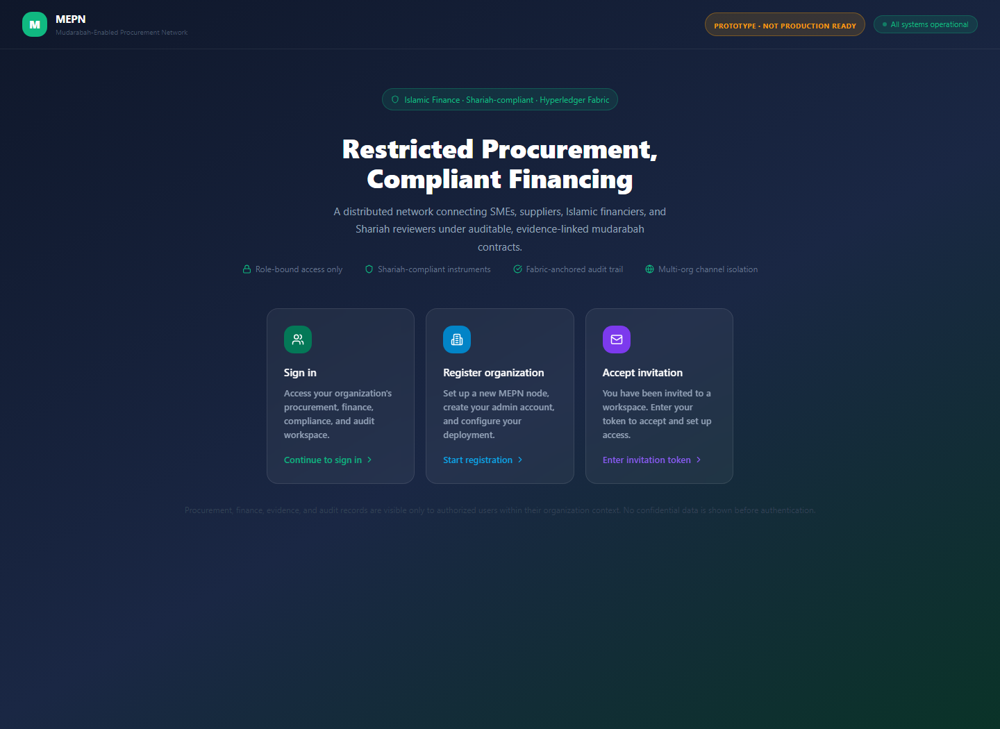

- Represents: public landing and pre-auth entry.
- Compare against: current login/dev sign-in screen.
- Source: local reconstruction of Figma Make source.

### Figma Screen 02 - Sign In Role Selection

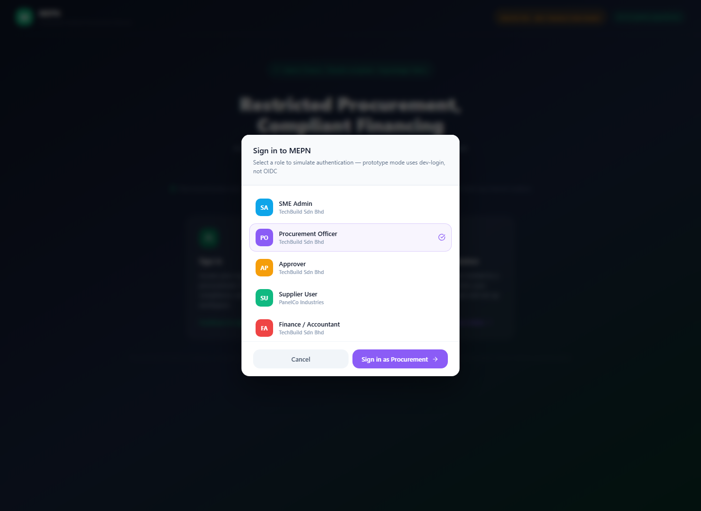

- Represents: prototype dev-login role picker modal.
- Compare against: current dev login screen and future OIDC login.
- Source: local reconstruction of Figma Make source.

### Figma Screen 03 - Organization Setup

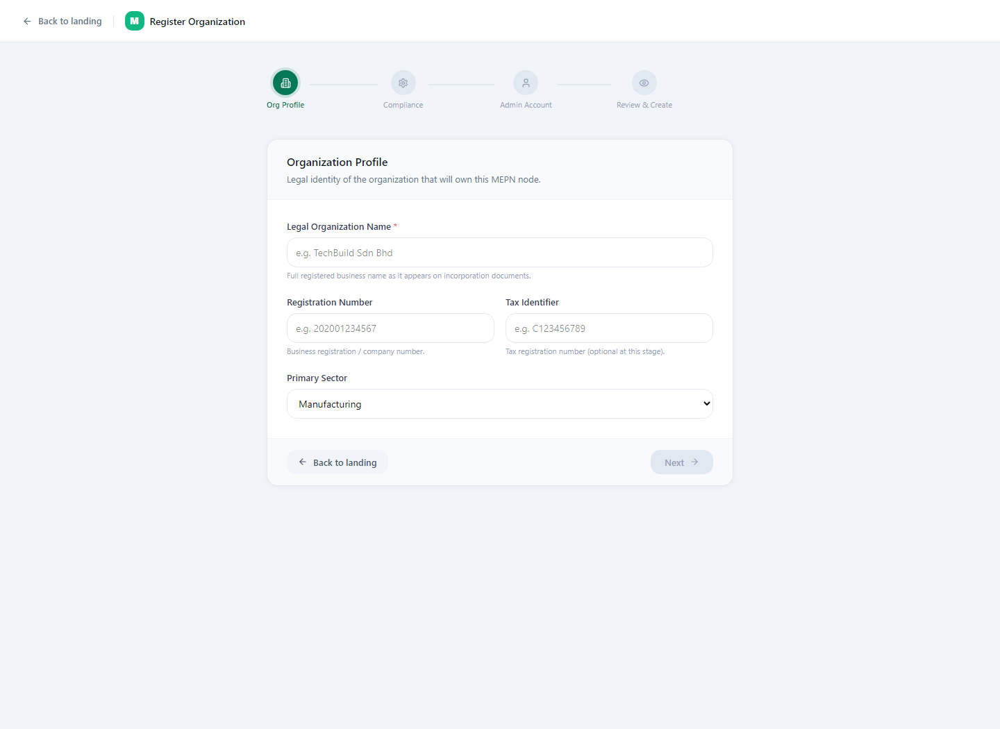

- Represents: organization registration wizard.
- Compare against: current `/org/setup`.
- Source: local reconstruction of Figma Make source.

### Figma Screen 04 - Role Dashboard

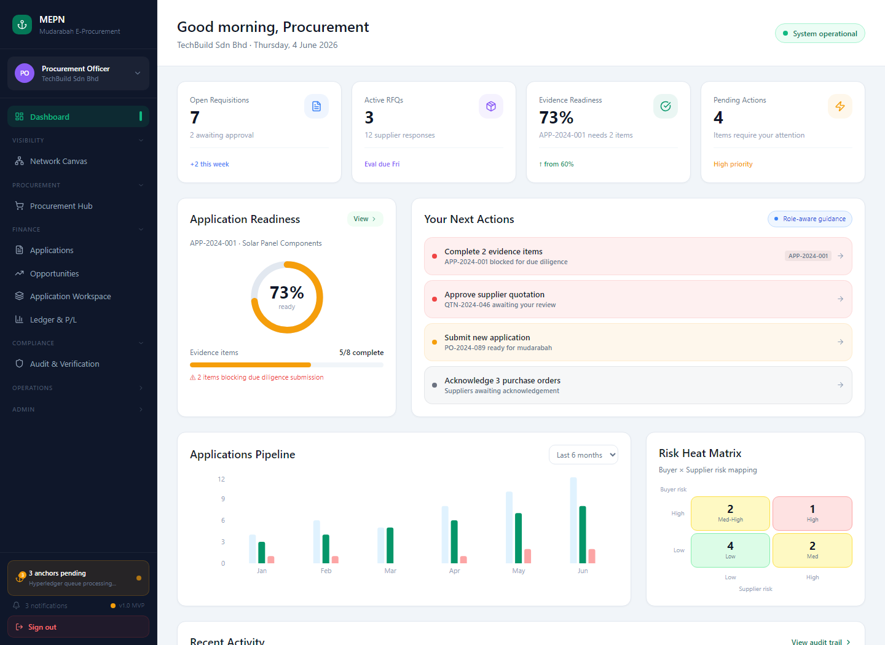

- Represents: non-admin role-aware dashboard.
- Compare against: current `/dashboard`.
- Source: local reconstruction of Figma Make source.

### Figma Screen 05 - Platform Manager Dashboard

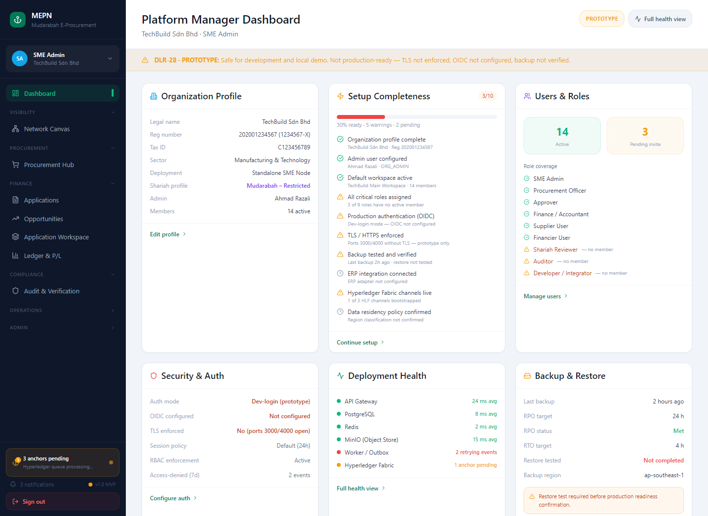

- Represents: SME Admin/platform manager dashboard.
- Compare against: current admin dashboard state and `/dashboard` for admin.
- Source: local reconstruction of Figma Make source.

### Figma Screen 06 - Procurement Hub

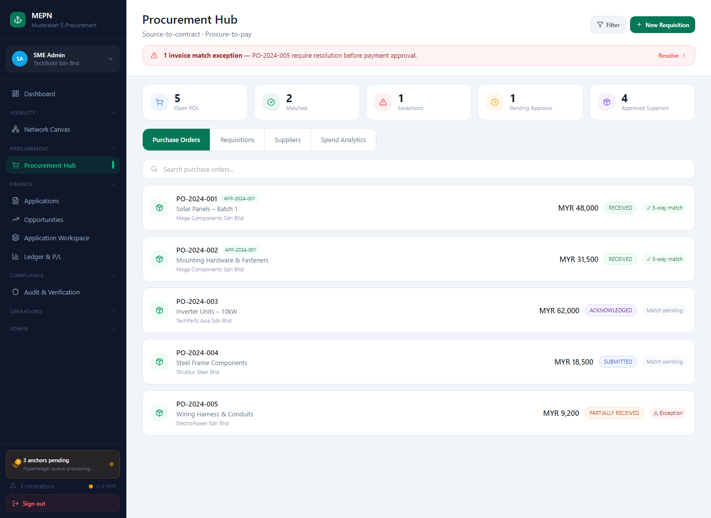

- Represents: procurement module hub and tabbed work area.
- Compare against: current procurement list/detail routes.
- Source: local reconstruction of Figma Make source.

### Figma Screen 07 - Applications List

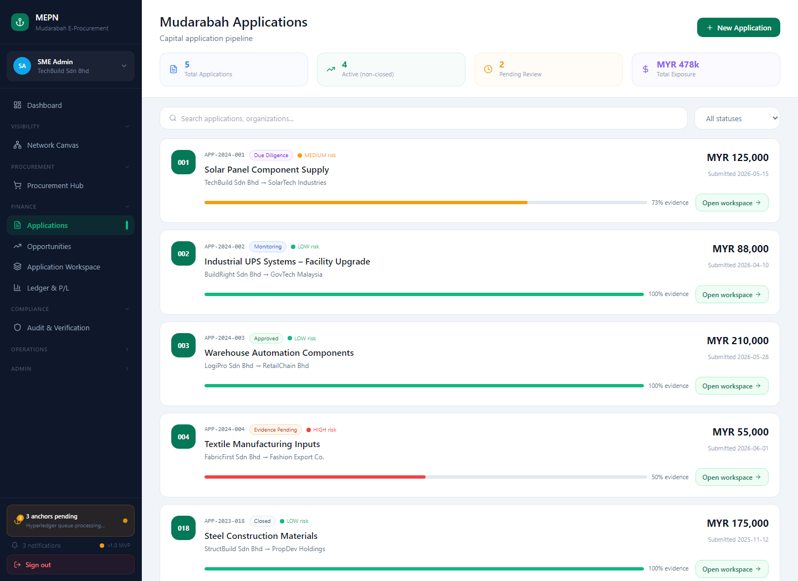

- Represents: mudarabah application pipeline.
- Compare against: current `/finance/applications`.
- Source: local reconstruction of Figma Make source.

### Figma Screen 08 - Application Workspace

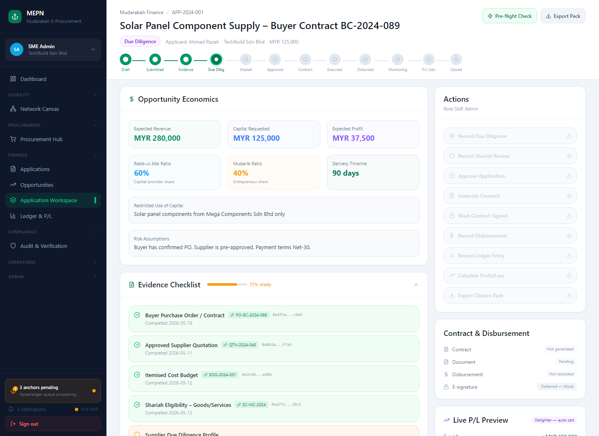

- Represents: finance application lifecycle workspace.
- Compare against: current `/finance/applications/:id`.
- Source: local reconstruction of Figma Make source.

### Figma Screen 09 - Finance Opportunities

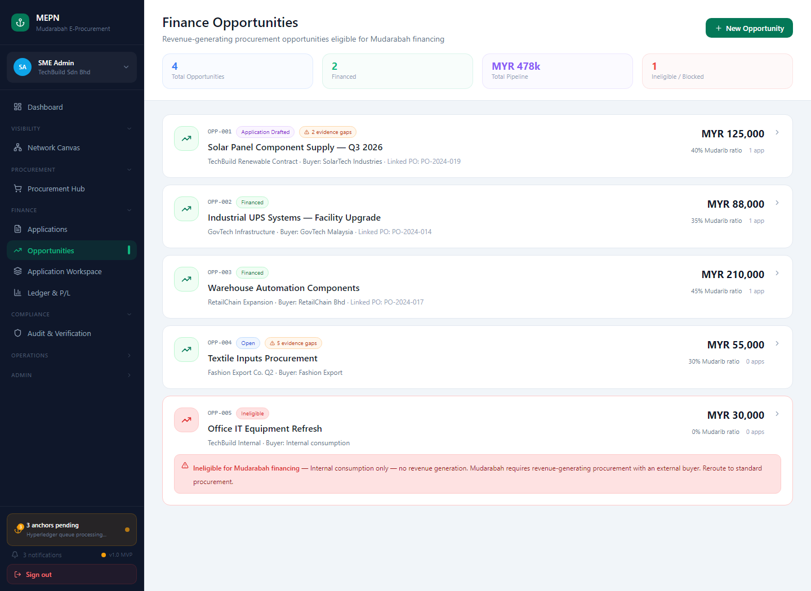

- Represents: opportunity list and creation direction.
- Compare against: current `/finance/opportunities`.
- Source: local reconstruction of Figma Make source.

### Figma Screen 10 - Network Canvas


- Represents: network graph/canvas cockpit.
- Compare against: current graph/project network route.
- Source: local reconstruction of Figma Make source.

### Figma Screen 11 - Ledger And Profit/Loss

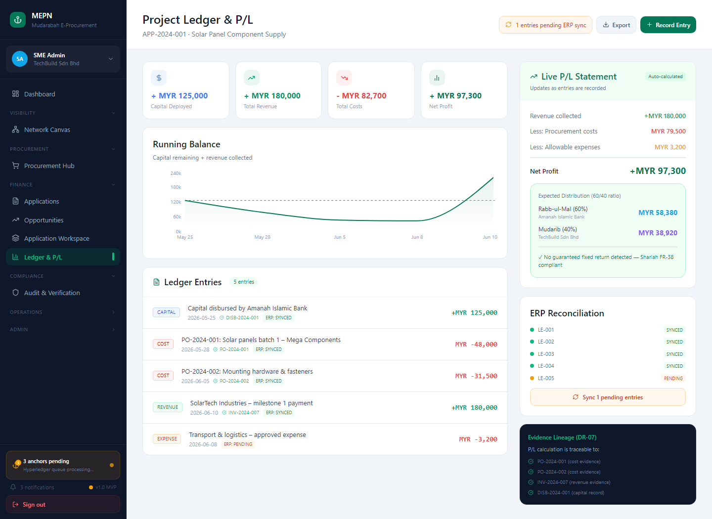

- Represents: project ledger and P/L explanation surface.
- Compare against: current finance ledger and closure surfaces.
- Source: local reconstruction of Figma Make source.

### Figma Screen 12 - Audit And Verification


- Represents: audit event, evidence pack, closure, and hash verification view.
- Compare against: current `/audit/search`, entity timeline, and hash screens.
- Source: local reconstruction of Figma Make source.

### Figma Screen 13 - Integrations

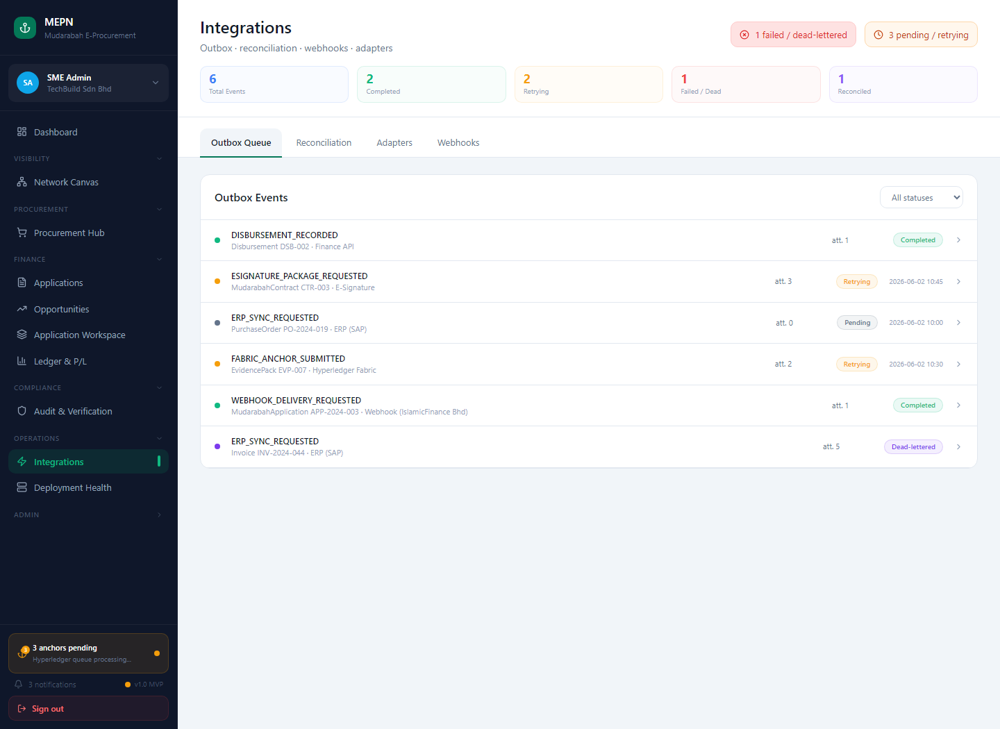

- Represents: integration adapters, outbox, reconciliation, and webhooks.
- Compare against: current `/integrations`.
- Source: local reconstruction of Figma Make source.

### Figma Screen 14 - Operations Health

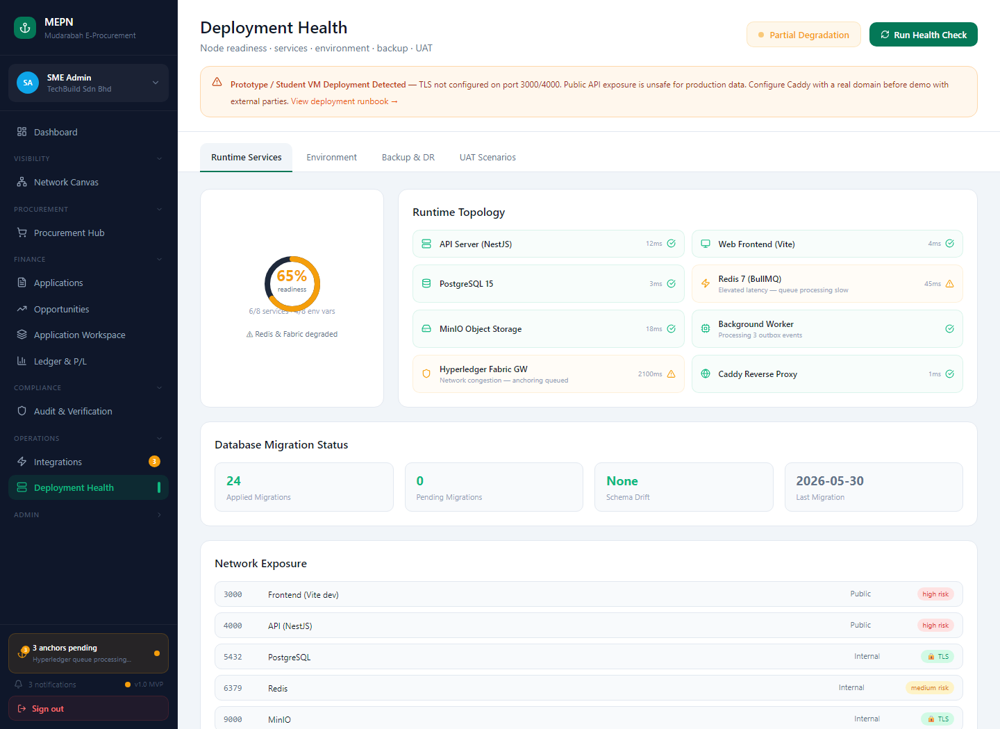

- Represents: deployment health and runtime readiness.
- Compare against: current operations/deployment health surfaces.
- Source: local reconstruction of Figma Make source.

### Figma Screen 15 - Admin

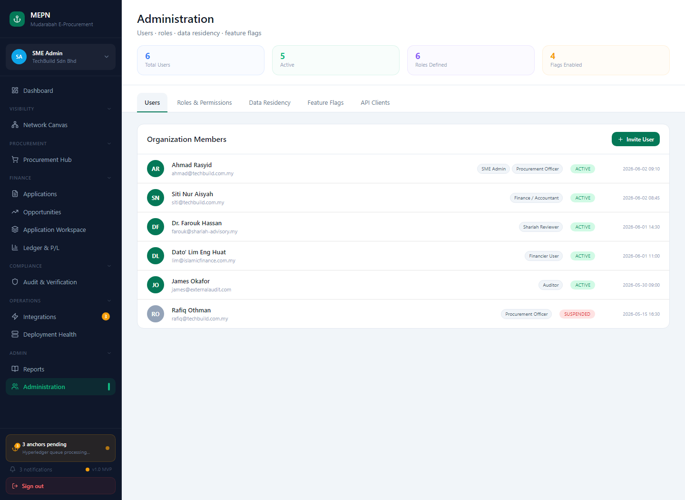

- Represents: administration, users, roles, flags, and settings direction.
- Compare against: current identity/admin routes.
- Source: local reconstruction of Figma Make source.

### Figma Screen 16 - Reports

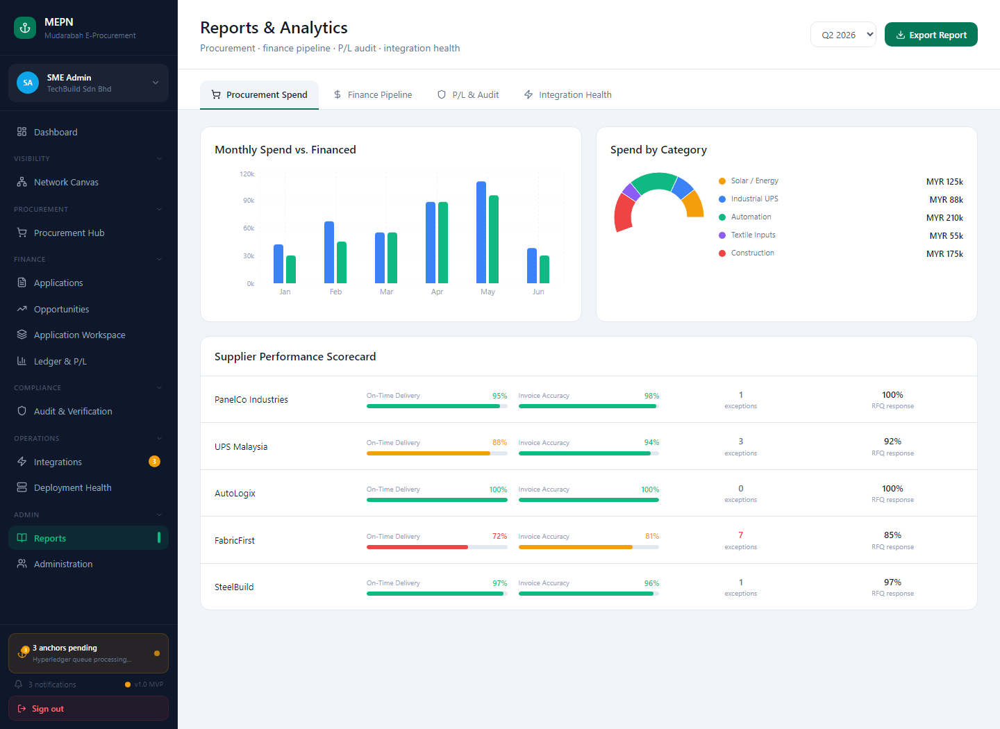

- Represents: reports and export direction.
- Compare against: current reporting/export roadmap.
- Source: local reconstruction of Figma Make source.

## Screen/View Inventory

| Make screen/view | Make source | Current production comparison | Evidence |
|---|---|---|---|
| Landing | `LandingView.tsx` | `/login` and public entry | Make source/context + screenshot |
| Sign-in role selection | `LandingView.tsx` modal | dev login/session page | Make source/context + screenshot |
| Organization setup | `OrgSetupView.tsx` | `/org/setup` | Make source/context + screenshot |
| Invite acceptance | `InviteView.tsx` | invitation/onboarding roadmap | Make source/context, not screenshotted |
| Platform Manager Dashboard | `PlatformDashboardView.tsx` | admin `/dashboard` | Make source/context + screenshot |
| Role Dashboard | `DashboardView.tsx` | role-aware `/dashboard` | Make source/context + screenshot |
| Procurement Hub | `ProcurementView.tsx` | procurement module routes | Make source/context + screenshot |
| Applications List | `ApplicationsList.tsx` | `/finance/applications` | Make source/context + screenshot |
| Application Workspace | `ApplicationWorkspace.tsx` | `/finance/applications/:id` | Make source/context + screenshot |
| Opportunities | `OpportunitiesView.tsx` | `/finance/opportunities` | Make source/context + screenshot |
| Network Canvas | `NetworkCanvas.tsx` | graph/project network route | Make source/context + screenshot |
| Ledger and P/L | `LedgerView.tsx` | finance ledger/P&L route | Make source/context + screenshot |
| Audit and Verification | `AuditView.tsx` | audit search/entity/hash routes | Make source/context + screenshot |
| Integrations | `IntegrationsView.tsx` | `/integrations` | Make source/context + screenshot |
| Operations Health | `OperationsView.tsx` | deployment/operations route | Make source/context + screenshot |
| Admin | `AdminView.tsx` | identity/admin routes | Make source/context + screenshot |
| Reports | `ReportsView.tsx` | reports/export roadmap | Make source/context + screenshot |

## Role-Based Entry Flows

Directly observed from Make source/context:

- Anonymous user lands on `LandingView`.
- `Continue to sign in` opens a role selection modal.
- Selecting a role and confirming moves to authorized dashboard state.
- `Start registration` opens `OrgSetupView`.
- Completing organization setup signs in as SME Admin and opens dashboard.
- `Enter invitation token` opens `InviteView`.
- Invitation acceptance routes by role:
  - Supplier User -> Procurement Hub.
  - Financier User -> Applications.
  - Shariah Reviewer -> Applications.
  - Auditor -> Audit and Verification.
  - Procurement Officer -> Applications.
  - Approver -> Applications.

Production behavior must remain API-backed:

- Production should not use Make role selection as authentication.
- Role claims should come from the dev session provider locally and OIDC later.
- Invitation acceptance should create/verify membership server-side.

## Primary User Journeys

### Journey 1 - Onboard organization

Flow: Landing -> Register organization -> organization profile -> compliance
and deployment -> admin account -> review/create -> dashboard.

Current production status: `/org/setup` exists and creates organization-related
records through the API. The Make wizard has clearer multi-step visual structure
that can be adapted.

### Journey 2 - Role dashboard to task

Flow: Sign in -> dashboard -> task/KPI/action -> module route.

Current production status: role-aware dashboard and smart task inbox exist.
Figma provides denser task, health, and recent activity presentation.

### Journey 3 - Procurement evidence

Flow: Procurement Hub -> requisitions/POs/suppliers/analytics -> detail record
-> audit/evidence linkage -> opportunity.

Current production status: production has broader API-backed procurement routes.
Figma provides a stronger module landing hub.

### Journey 4 - Mudarabah application review

Flow: Opportunities -> Applications -> Application Workspace -> evidence ->
due diligence -> Shariah review -> approval -> contract -> disbursement ->
ledger -> P/L -> closure.

Current production status: production has role-scoped finance workspaces and
domain-safe ledger/P&L foundations. Figma provides a richer single-workspace
status and next-action experience.

### Journey 5 - Audit, verification, and integrations

Flow: Audit and Verification -> hash/anchor review -> evidence pack/closure ->
Integrations -> outbox/reconciliation -> Operations Health.

Current production status: production has audit filtering, anchor states,
integration requests, outbox/reconciliation, and operations documentation.
Figma provides clearer operational status density and visual status grouping.

## State Transitions, Modals, Tabs, Panels, And Filters

Directly observed from Make source/context:

- Landing modal: sign-in role selection.
- Organization setup wizard: step index from organization profile through
  review/create, with disabled next button until required fields are filled.
- Sidebar: role selector, collapsible sections, nav item badges, anchor status
  widget.
- Dashboard: task/action cards navigate to workspace, procurement, ledger,
  audit, integrations, or operations.
- Procurement: tab state for purchase orders, requisitions, suppliers, and
  analytics; search/filter state; selected/expanded purchase order state.
- Applications: search and status filter; open workspace action.
- Opportunities: new opportunity modal, source document selection, two-step
  creation, expand/collapse opportunity details, create/open application.
- Application Workspace: lifecycle stepper, pre-flight check modal, expandable
  evidence/review/audit panels, action buttons gated by current lifecycle and
  role.
- Network Canvas: filters, risk/finance toggles, node detail panel, zoom
  controls, close detail action.
- Ledger: add-entry modal with entry type, amount, description, date, and
  save/cancel.
- Audit: tabs for events, evidence packs, closure; search/filter; hash verify
  input with valid/invalid local result.
- Integrations: tabs for outbox, reconciliation, adapters, webhooks; expandable
  status cards; status filter.
- Operations: tabs for runtime services, environment, backup/DR, UAT; run
  health check action.
- Admin: tabs for users, roles, residency, feature flags, API clients.
- Reports: tabs for procurement, finance, audit, integration; period selection.

Not verified:

- Full mobile responsive behavior.
- Keyboard focus order and tab order.
- Screen reader labels and ARIA behavior.
- All modal submit error states.
- Real API error handling for Make screens, because Make uses local fixtures.

## Screen-By-Screen Comparison And Implementation-Safe TODOs

### 1. App Shell And Sidebar

Current production UI summary:

- Uses React Router routes and reusable route metadata.
- Sidebar visibility is permission-aware.
- Direct URL access can show access denied.
- Session comes from `AuthProvider` and dev auth endpoints.

Figma Make screenshot reference:

- `assets/figma-make-screen-04-dashboard.png`
- `assets/figma-make-screen-05-platform-manager-dashboard.png`

Figma Make interaction behavior:

- Sidebar groups routes by module.
- Role selector changes local prototype role.
- Operations and Admin sections collapse/expand.
- Anchor status widget shows pending anchor count.

Gap analysis:

- Production shell is safer, but Figma shell has better grouping and status
  density.
- Production must not copy role switching into the normal production sidebar.

Implementation-safe TODOs:

- [ ] Add production-safe sidebar section grouping matching the Figma hierarchy.
- [ ] Add route metadata badges for pending tasks/outbox counts.
- [ ] Add an anchor/outbox widget that shows pending/failed/verified only from
      backend status.
- [ ] Keep role switching dev-only.

### 2. Landing, Login, And Organization Setup

Current production UI summary:

- Current dev login accepts email and organization ID.
- `/org/setup` exists and creates organization records through the API.

Figma Make screenshot reference:

- `assets/figma-make-screen-01-landing.png`
- `assets/figma-make-screen-02-sign-in-role-selection.png`
- `assets/figma-make-screen-03-organization-setup.png`

Figma Make interaction behavior:

- Landing presents sign in, register organization, and accept invitation cards.
- Sign-in modal selects a simulated role.
- Organization setup is a multi-step wizard.

Gap analysis:

- Current login is more implementation-realistic, but Figma makes the entry
  points clearer.
- Organization setup can adopt the wizard structure without changing backend
  behavior.

Implementation-safe TODOs:

- [ ] Add a dev-only landing/help layer if useful for demonstrations.
- [ ] Keep real auth/OIDC separate from Make role switching.
- [ ] Improve organization setup wizard structure and review step.
- [ ] Add invitation flow only when backend invitation state exists.

### 3. Dashboard

Current production UI summary:

- Shows API, PostgreSQL, and Redis health.
- Shows role-aware KPIs and smart tasks.
- Some dashboard values remain fixtures.

Figma Make screenshot reference:

- `assets/figma-make-screen-04-dashboard.png`
- `assets/figma-make-screen-05-platform-manager-dashboard.png`

Figma Make interaction behavior:

- SME Admin receives platform manager dashboard.
- Other roles receive role-specific task/KPI dashboard.
- Action cards navigate to modules.
- System and setup readiness are visible.

Gap analysis:

- Current dashboard has correct architecture, but less review-ready density.
- Figma dashboard better communicates role context, task urgency, and platform
  readiness.

Implementation-safe TODOs:

- [ ] Add role-specific header context and system status.
- [ ] Add evidence readiness and recent audit activity cards.
- [ ] Use backend dashboard DTOs when available; label fixtures while present.
- [ ] Add explicit pending/failed integration indicators, not fake success.

### 4. Procurement Hub

Current production UI summary:

- Production has API-backed procurement modules for requisitions, projects,
  suppliers, approval tasks, RFQs, quotations, POs, receipts, invoices, and
  matching.
- Current screenshots show requisition and PO detail routes.

Figma Make screenshot reference:

- `assets/figma-make-screen-06-procurement-hub.png`

Figma Make interaction behavior:

- Procurement Hub has KPI cards, exception alert, tabs, search, supplier
  scoring, and analytics.

Gap analysis:

- Production has wider workflow coverage; Figma has a clearer landing hub.
- The current production UI should better summarize exceptions and matching
  status before users drill into detail pages.

Implementation-safe TODOs:

- [ ] Add procurement hub summary cards and exception alerts.
- [ ] Add tabbed procurement overview without removing deep routes.
- [ ] Add supplier score/status display only when backend or explicit fixtures
      support it.
- [ ] Seed the TechBuild/SolarTech procurement scenario for demos.

### 5. Applications And Opportunities

Current production UI summary:

- Finance opportunities and applications exist.
- Opportunity creation validates revenue-generating source documents.
- Application status model and filtering are implemented at foundation level.

Figma Make screenshot reference:

- `assets/figma-make-screen-07-applications-list.png`
- `assets/figma-make-screen-09-finance-opportunities.png`

Figma Make interaction behavior:

- Applications are presented as a pipeline.
- Opportunities have source document selection and application draft creation.
- Opportunity detail panels expand from the list.

Gap analysis:

- Production behavior is aligned, but Figma communicates evidence readiness and
  review stage more clearly.

Implementation-safe TODOs:

- [ ] Add eligibility explanation and blocked-case examples.
- [ ] Add evidence, due diligence, Shariah, contract, and audit summary columns
      to the application list.
- [ ] Keep opportunity/application creation API-backed.

### 6. Application Workspace

Current production UI summary:

- `/finance/applications/:id` exists with workspace tabs and role-aware actions.
- Mutations depend on backend support and permission checks.

Figma Make screenshot reference:

- `assets/figma-make-screen-08-application-workspace.png`

Figma Make interaction behavior:

- Horizontal lifecycle stepper shows draft through closed.
- Evidence, due diligence, Shariah, contract, disbursement, ledger, P/L, and
  audit are visible in one workspace.
- Actions are disabled or enabled based on local role/lifecycle state.

Gap analysis:

- Current production workspace is structurally aligned, but Figma is stronger
  for next-action guidance and lifecycle visibility.
- Make local state must not be used as proof of approvals or disbursement.

Implementation-safe TODOs:

- [ ] Improve lifecycle stepper and next-action copy.
- [ ] Add explicit blocked explanations for contract/disbursement.
- [ ] Add role guidance panels for procurement officer, financier, Shariah
      reviewer, finance/accountant, and auditor.
- [ ] Preserve backend as the source of truth for every mutation.

### 7. Ledger, Profit/Loss, And Closure

Current production UI summary:

- Ledger and P/L foundations exist.
- Domain tests protect against guaranteed fixed-return behavior.
- Closure pack state is visible.

Figma Make screenshot reference:

- `assets/figma-make-screen-11-ledger-profit-loss.png`

Figma Make interaction behavior:

- Ledger shows entry types, revenue/cost evidence, preliminary P/L, and
  distribution view.
- Add-entry modal is local prototype state.

Gap analysis:

- Production is domain-safe; Figma is better for explaining the calculation to
  reviewers.

Implementation-safe TODOs:

- [ ] Add P/L explanation panel using revenue, allowed cost, net result, and
      approved ratio.
- [ ] Add warning that no fixed guaranteed return is calculated.
- [ ] Add loss exception display for genuine loss vs breach/negligence.
- [ ] Keep all calculation results backend/API backed.

### 8. Audit And Verification

Current production UI summary:

- Audit search, entity timeline, and Fabric anchor status surfaces exist.
- Production distinguishes pending, submitted, verified, failed, and
  unavailable anchor states.

Figma Make screenshot reference:

- `assets/figma-make-screen-12-audit-verification.png`

Figma Make interaction behavior:

- Audit tabs separate events, evidence packs, and closure.
- Hash verification input returns local valid/invalid result.
- Fabric status is displayed in the review context.

Gap analysis:

- Current production honesty rule is correct.
- Figma gives a clearer reviewer center pattern.

Implementation-safe TODOs:

- [ ] Add verification legend for local audit, hash, pending anchor, submitted,
      verified, failed, and unavailable.
- [ ] Add canonical hash explanation for non-developer reviewers.
- [ ] Link audit rows to source records and evidence items.
- [ ] Never show verified Fabric status unless backend status is verified.

### 9. Network Canvas

Current production UI summary:

- Graph/canvas route exists as read-only visualization.
- Graph visibility is permission-filtered.

Figma Make screenshot reference:

- `assets/figma-make-screen-10-network-canvas.png`

Figma Make interaction behavior:

- Shows organization, supplier, buyer, financier, opportunity, application, and
  document/channel nodes.
- Supports node detail panel, filters, risk/finance toggles, and zoom controls.

Gap analysis:

- Production graph is correctly not a source of truth.
- Figma shows the desired cockpit density and edge semantics.

Implementation-safe TODOs:

- [ ] Add toolbar for zoom, fit, filters, and risk overlays.
- [ ] Add node detail panel with source-record links.
- [ ] Add edge labels such as supplies, buys from, finances, evidences, and
      anchors.
- [ ] Keep graph read-only until persistence is designed.

### 10. Integrations And Operations

Current production UI summary:

- Integration requests go through outbox/adapters.
- Current UI shows status and auditor read-only behavior.
- Operations/deployment documentation exists.

Figma Make screenshot reference:

- `assets/figma-make-screen-13-integrations.png`
- `assets/figma-make-screen-14-operations-health.png`

Figma Make interaction behavior:

- Integrations use tabs for outbox, reconciliation, adapters, and webhooks.
- Operations use tabs for runtime services, environment, backup/DR, and UAT.
- Degraded runtime states are visible.

Gap analysis:

- Production has the correct adapter/outbox direction.
- Figma provides stronger operational status explanation and retry visibility.

Implementation-safe TODOs:

- [ ] Add outbox columns for attempts, next retry, last error, and idempotency
      key.
- [ ] Add reconciliation detail cards.
- [ ] Add backup, worker, queue, and deployment health panels.
- [ ] Label mock adapters clearly and never claim external provider health
      unless backed by real health checks or explicit fixtures.

### 11. Admin And Reports

Current production UI summary:

- Identity/organization foundations exist.
- Reports are still roadmap-level compared with core workflows.

Figma Make screenshot reference:

- `assets/figma-make-screen-15-admin.png`
- `assets/figma-make-screen-16-reports.png`

Figma Make interaction behavior:

- Admin view has users, roles, residency, feature flags, and API clients tabs.
- Reports view has procurement, finance, audit, and integration reports.

Gap analysis:

- Admin and reports need stronger production screens if they are part of the
  final demo path.

Implementation-safe TODOs:

- [ ] Build admin screens around users, roles, memberships, invitations, and
      organization settings.
- [ ] Audit admin changes where backend support exists.
- [ ] Add report catalogue and clearly label unimplemented export formats.

## UX Risks, Missing States, And Unclear Flows

- Role switching in the Make sidebar is convenient for demos but unsafe if
  copied into production auth.
- The Make sidebar can imply `Fabric anchors synced`; production must show
  verified only when anchored/verified by backend state.
- Some Make actions advance lifecycle locally. Production approval,
  disbursement, contract, ledger, closure, and export success must be
  API-backed.
- The Make prototype has rich status cards but limited explicit API error
  states.
- Some dense panels may overflow on small screens; mobile behavior was not
  visually verified in this pass.
- Invitation, report export, backup/restore, and some integration details are
  visually represented but not fully verified as production workflows.

## Accessibility And Responsive-Design Risks

Not verified:

- Keyboard-only navigation through sidebar, tabs, modals, graph controls, and
  wizard steps.
- Screen reader semantics for icon-only status indicators.
- Focus trapping in sign-in, opportunity, pre-flight, and ledger modals.
- Mobile layout for dense workspace, graph, operations, and reports screens.
- Color contrast for low-contrast secondary text in the dark sidebar and cards.

Implementation-safe TODOs:

- [ ] Add automated component tests for keyboard tab/focus where practical.
- [ ] Verify responsive screenshots for dashboard, workspace, audit, and graph.
- [ ] Add accessible names for status icons and icon buttons.
- [ ] Ensure modals trap focus and return focus on close.

## Recommendations And Priority Fixes

### Priority 0 - Keep production safety rules intact

- [ ] Do not copy mock role switching into production auth.
- [ ] Do not copy fake Fabric anchoring.
- [ ] Do not copy fake approval, disbursement, ledger closure, or integration
      success.
- [ ] Do not treat Make local state as production routing or persistence.

### Priority 1 - Adapt the shell and dashboard visual hierarchy

- [ ] Add production-safe sidebar grouping and badges.
- [ ] Add dashboard role context, evidence readiness, recent activity, and
      integration backlog.
- [ ] Keep all status values API-backed or explicitly labelled fixture data.

### Priority 2 - Improve finance review clarity

- [ ] Add lifecycle stepper and next-action guidance to application workspace.
- [ ] Add evidence, due diligence, Shariah, contract, disbursement, ledger, and
      audit summaries in the workspace.
- [ ] Add blocked-state explanations for finance gates.

### Priority 3 - Make reviewer surfaces more understandable

- [ ] Add audit/Fabric status legend.
- [ ] Add P/L explanation and no-guaranteed-return note.
- [ ] Add closure pack checklist and evidence source links.

### Priority 4 - Strengthen operational visibility

- [ ] Add outbox/reconciliation details.
- [ ] Add deployment health, queue, worker, backup, and adapter health panels.
- [ ] Label mock providers and unavailable integrations clearly.

## Appendix: Inferred Flow Map

Directly observed from Make source/context unless marked otherwise:

```text
Session checking -> timeout -> Landing

Landing -> Continue to sign in -> Sign-in role modal
Sign-in role modal -> choose role -> Sign in as role -> Dashboard
Landing -> Start registration -> Organization setup wizard
Organization setup wizard -> Create Organization -> SME Admin Dashboard
Landing -> Enter invitation token -> Invite acceptance
Invite acceptance -> Accept supplier invite -> Procurement Hub
Invite acceptance -> Accept financier invite -> Applications
Invite acceptance -> Accept Shariah invite -> Applications
Invite acceptance -> Accept auditor invite -> Audit and Verification

Dashboard -> task/action -> Application Workspace
Dashboard -> task/action -> Procurement Hub
Dashboard -> task/action -> Ledger and P/L
Dashboard -> task/action -> Audit and Verification
Dashboard -> admin/setup action -> Admin or Integrations or Operations

Sidebar -> Network Canvas -> node click -> node detail panel
Sidebar -> Procurement Hub -> tab/search/select PO -> detail/linked workspace
Sidebar -> Applications -> search/filter/open -> Application Workspace
Sidebar -> Opportunities -> New Opportunity -> source step -> details step -> draft/application
Sidebar -> Application Workspace -> evidence/review/action panels
Sidebar -> Ledger and P/L -> Add Entry modal -> local entry state
Sidebar -> Audit and Verification -> hash input -> verify result
Sidebar -> Integrations -> tab/filter/expand integration card
Sidebar -> Deployment Health -> Run Health Check -> running/updated health state
Sidebar -> Administration -> tab/toggle feature/admin review
Sidebar -> Reports -> tab/period/export direction
```

Production behavior must remain API-backed:

```text
Production login -> AuthProvider/session claims -> route registry/guards
Production action -> API mutation -> database/audit/outbox update -> UI query refresh
Production verification -> backend hash/anchor status -> honest UI state
```
