# Current Web UI Workflow Compared With Figma Prototype

## Purpose

This document compares the current MEPN web UI against the Figma Make prototype
stored in `docs/design/figma-make-reference/prototype-src/`.

It follows the style of `docs/ui/skeletal-web-ui-workflow.md`, but focuses on
the design gap between:

- the current production React app in `apps/web/src`
- the Figma Make visual/interaction reference in
  `docs/design/figma-make-reference/prototype-src/src/app/components`

The goal is not to copy the Figma prototype wholesale. The goal is to identify
which visual, layout, density, and workflow presentation patterns should be
adapted into the production UI while preserving real routing, RBAC, API-backed
state, audit behavior, and domain rules.

## Related Documents

- `docs/ui/skeletal-web-ui-workflow.md`
- `docs/ui/figma-to-ui-contract-map.md`
- `docs/design/figma-make-reference/README.md`
- `docs/use-cases-and-mock-data.md`

## Comparison Baseline

Current UI baseline:

- React Router application shell.
- Role-aware navigation from route metadata.
- Dev authentication/session provider.
- Shared loading, empty, error, and permission-denied states.
- API-backed screens for core procurement, evidence, audit, finance, graph, and
  integration workflows.
- Some frontend fixtures remain for dashboard, graph, role summaries, and
  prototype display states.

Figma prototype baseline:

- Single prototype shell using local view switching.
- Dark dense sidebar with section grouping, role selector, badges, and anchor
  status widget.
- High-density dashboard with KPI cards, task inbox, charts, readiness cards,
  and recent activity.
- Rich application workspace with lifecycle stepper, role guidance banners,
  evidence checklist, review panels, ledger, audit, and Fabric status.
- Procurement hub with KPI strip, exception alert, tabs, supplier scoring,
  purchase-order list, and analytics.
- Graph/canvas with pan, zoom, filters, colored nodes, channel nodes, risk
  indicators, and finance/procurement relationships.
- Integration operations surface with outbox events, retry explanations,
  idempotency keys, adapters, reconciliation, and degraded states.

## Current UI Screenshot Evidence

The current production screenshots used for this comparison are stored under
`docs/ui/assets/` and have also been uploaded to this Figma review file:

<https://www.figma.com/design/KXHhtyeeWS51KUCaoBtDxe>

The Figma file is a review artifact only. It contains screenshots of the current
web UI so the team can compare the implemented screens with the Figma Make
prototype reference. It is not a new source of truth for routing, permissions,
workflow state, audit behavior, ledger calculation, or backend behavior.

### Screen 01 - Login

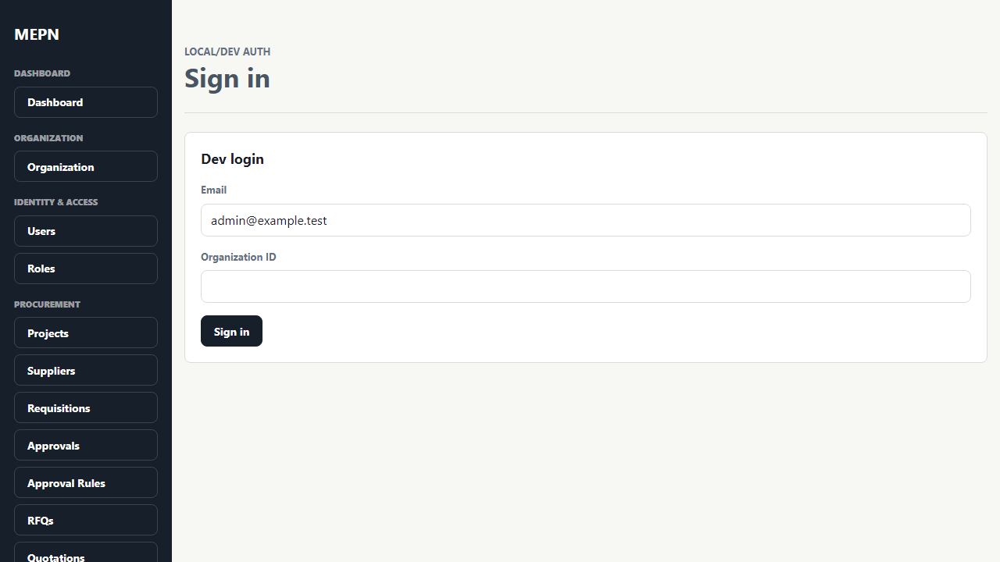

### Screen 02 - Dashboard

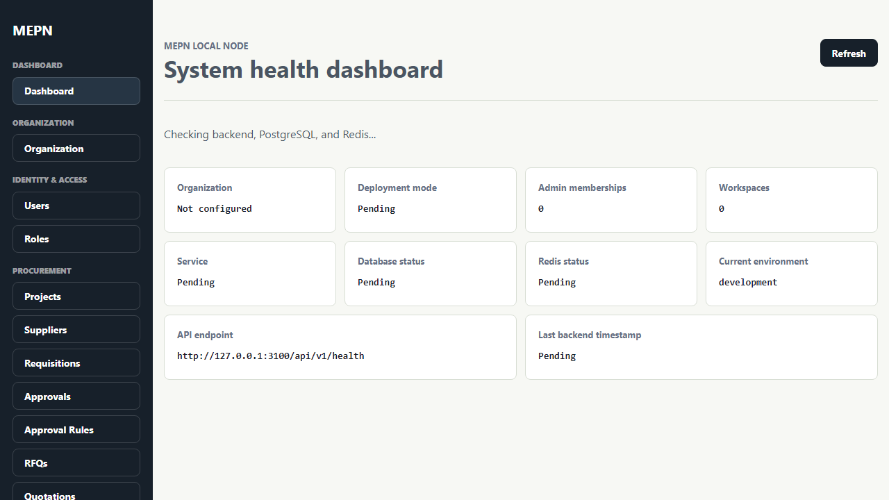

### Screen 03 - Organization Setup

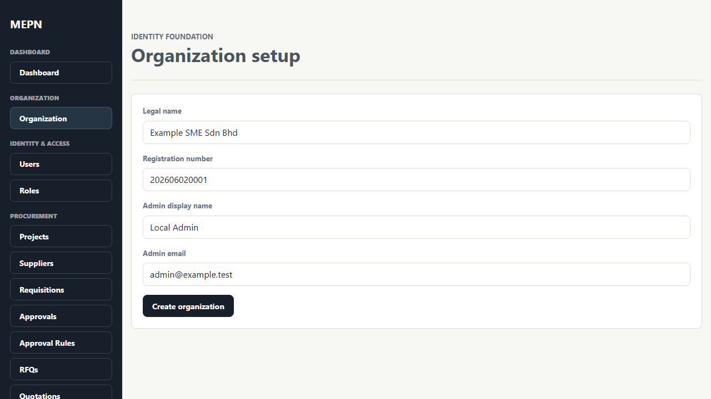

### Screen 04 - Procurement Requisitions

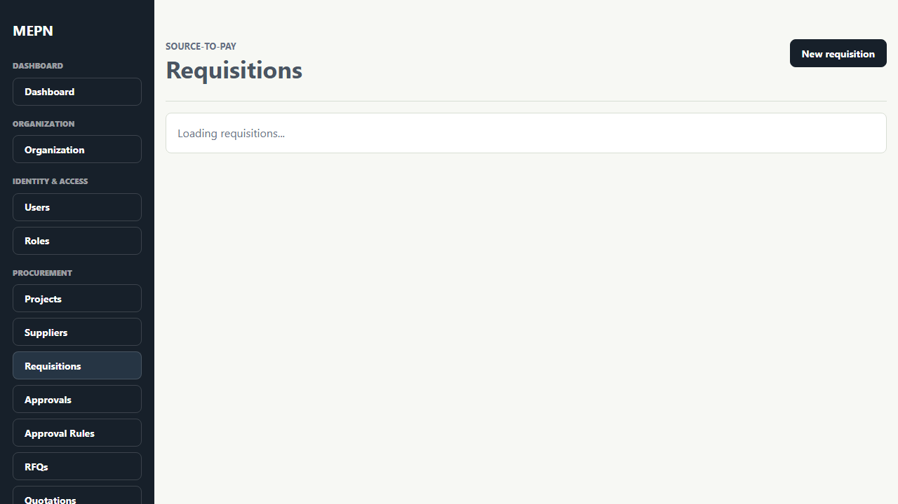

### Screen 05 - Purchase Order Detail

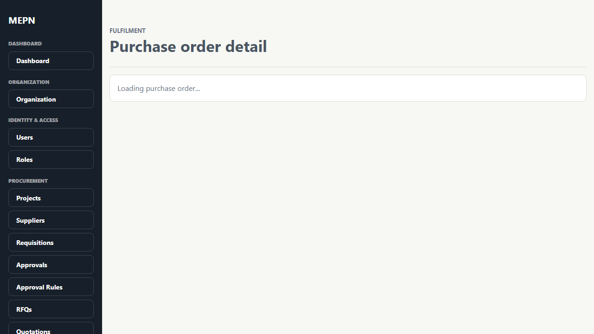

### Screen 06 - Evidence Pack Detail

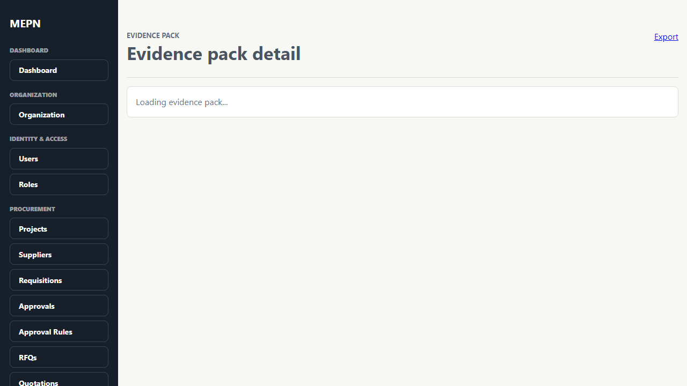

### Screen 07 - Audit Search

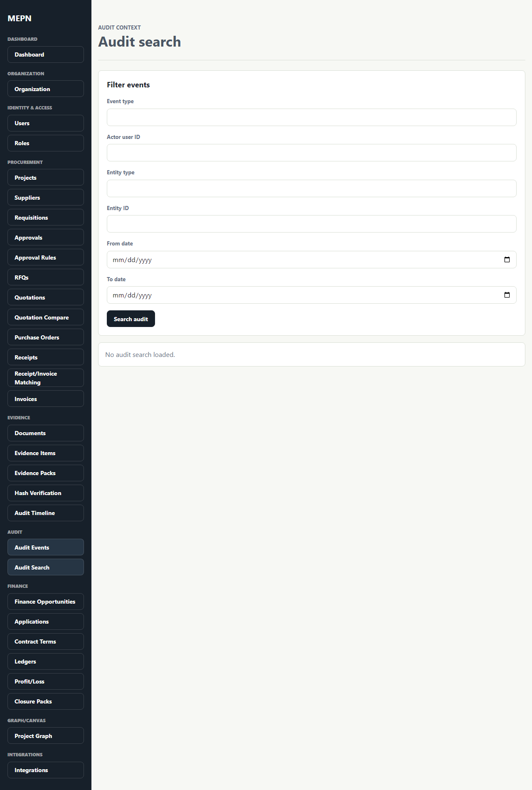

### Screen 08 - Finance Workspace

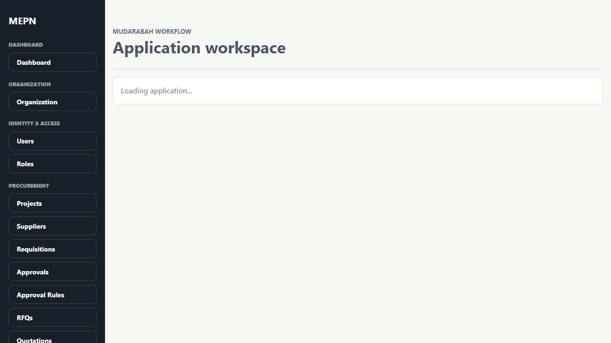

### Screen 09 - Closure Pack

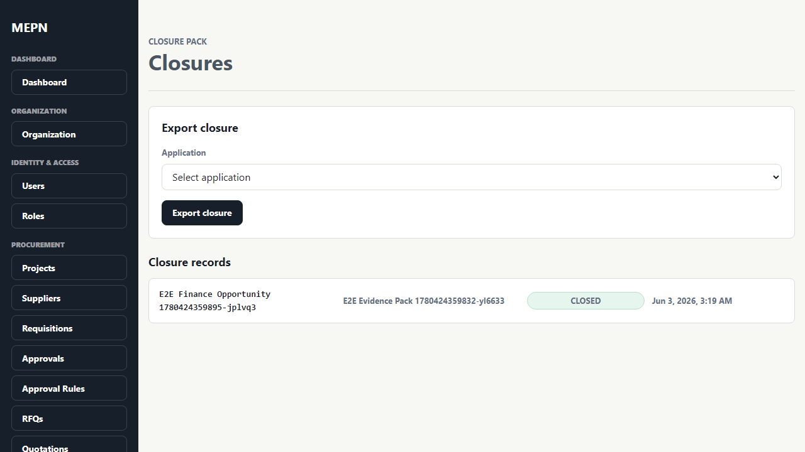

### Screen 10 - Project Graph

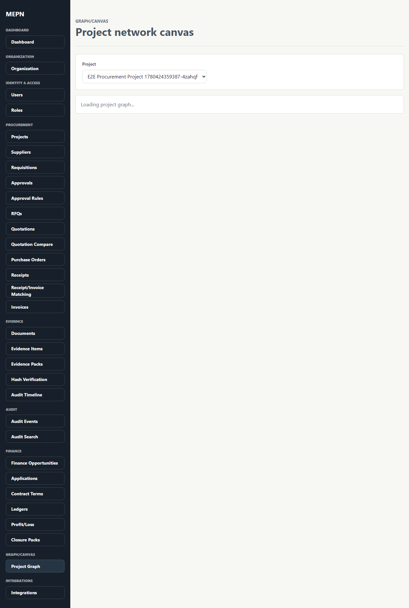

### Screen 11 - Integrations

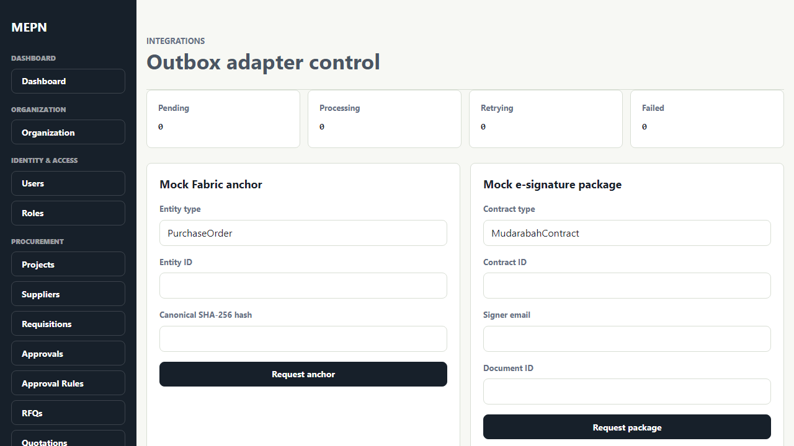

### Screen 12 - Auditor Read-Only Integrations

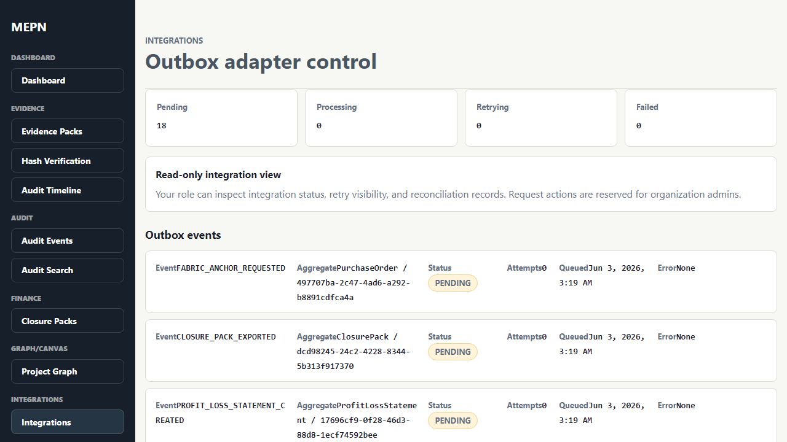

### Screen 13 - Access Denied

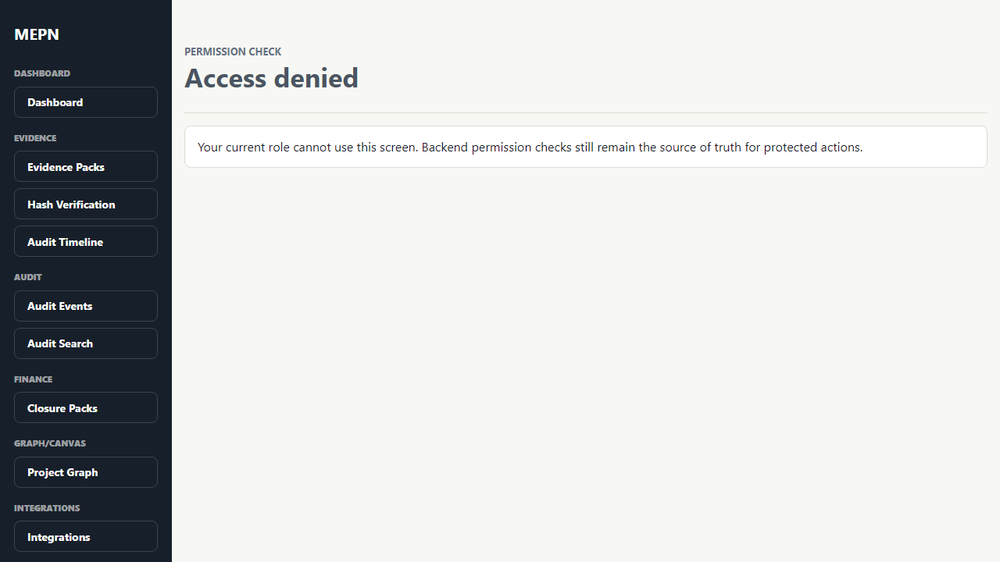

## Design Principle For Tailoring

Use this rule:

```text
Figma component -> production route -> UI contract section -> production behavior
```

Do not copy:

- Figma mock role switching as production auth.
- Fake successful Fabric anchoring.
- Fake approval, disbursement, ledger closure, or external integration success.
- Prototype-only local state.
- Prototype-only routing.

Adapt:

- layout density
- visual hierarchy
- card/table/badge/tabs patterns
- status wording
- reviewer guidance
- role-specific information architecture
- network and integration presentation

## Main Workflow Comparison

### Screen Group 01 - App Shell And Sidebar

Current production UI:

- Uses real React Router routes.
- Sidebar visibility is driven by route metadata and frontend authorization.
- Direct route access can show permission denied.
- Session is loaded through `AuthProvider`.

Figma reference:

- `Sidebar.tsx` uses a dark navy sidebar.
- Navigation is grouped by Visibility, Procurement, Finance, Compliance,
  Operations, and Admin.
- Role selector is visible in the sidebar.
- Anchor status widget appears near the bottom.
- Integrations show a badge count.

Gap:

- Current shell is more correct architecturally, but less visually close to the
  prototype.
- Current role switching is separated into dev auth/session behavior, which is
  correct for production direction.
- The sidebar can better expose module grouping, badges, and anchor/outbox
  status.

TODO:

- [ ] Add production-safe sidebar section grouping matching the Figma hierarchy.
- [ ] Add badge support for pending review/outbox counts from typed data.
- [ ] Add an anchor/outbox status widget that never claims verified anchoring
      unless the backend status is verified.
- [ ] Keep role switching out of production sidebar; use dev-only session tools
      for local testing.
- [ ] Align labels with Figma where they improve clarity: `Procurement Hub`,
      `Ledger & P/L`, `Audit & Verification`, `Deployment Health`.

### Screen Group 02 - Dashboard

Current production UI:

- Shows API, PostgreSQL, and Redis health.
- Shows role-aware dashboard content.
- Includes KPI grid and smart task inbox.
- Uses typed dashboard fixtures where backend aggregation is incomplete.

Figma reference:

- `DashboardView.tsx` shows dense role-specific KPI cards.
- Includes charts for pipeline and exposure.
- Includes evidence readiness, next actions, and recent activity.
- Uses strong visual hierarchy with white cards on a light gray canvas.

Gap:

- Current dashboard has the right product concept but should become more
  visually dense and review-ready.
- Current dashboard should better show recent activity, evidence readiness, and
  role-specific operating context.

TODO:

- [ ] Add a dashboard header with organization, role, and system status.
- [ ] Add evidence readiness card for the active finance/procurement case.
- [ ] Add recent activity feed from audit events.
- [ ] Add role-specific chart panels when backed by API or explicit fixtures.
- [ ] Replace dashboard fixtures with backend dashboard DTOs after API support
      is available.
- [ ] Use the mock data from `docs/use-cases-and-mock-data.md` for meaningful
      dashboard values.

### Screen Group 03 - Procurement Hub

Current production UI:

- Provides procurement routes and API-backed lists/details.
- Supports requisitions, projects, suppliers, approval tasks, approval rules,
  RFQs, quotations, purchase orders, receipts, invoices, and matching areas.
- Current walkthrough includes requisition and purchase order detail screens.

Figma reference:

- `ProcurementView.tsx` has a `Procurement Hub` landing page.
- Includes KPI strip for open POs, matched records, exceptions, pending
  approvals, and approved suppliers.
- Includes exception alert for invoice match issues.
- Uses tabbed navigation: Purchase Orders, Requisitions, Suppliers, Analytics.
- Shows supplier scoring and spend analytics.

Gap:

- Current UI has broader route coverage, but the Figma prototype has a clearer
  module landing/dashboard pattern.
- Procurement detail screens should keep API correctness but adopt stronger
  summary, exception, and matching visuals.

TODO:

- [ ] Create or refine a procurement hub landing screen with KPI strip.
- [ ] Add invoice/receipt matching exception alert.
- [ ] Add supplier score/status cards where backend supplier data supports it.
- [ ] Add tabbed procurement module overview without removing existing deep
      routes.
- [ ] Add spend/category analytics using real procurement totals or explicit
      demo fixtures.
- [ ] Seed the TechBuild/SolarTech procurement case from
      `docs/use-cases-and-mock-data.md`.

### Screen Group 04 - Opportunities And Applications List

Current production UI:

- Provides finance opportunities and application list foundations.
- Has typed status models, filters, and navigation to workspace routes.
- Enforces revenue-generating opportunity validation at the frontend foundation.

Figma reference:

- `OpportunitiesView.tsx` emphasizes creating opportunities from buyer PO,
  contract award, sales order, or equivalent revenue documents.
- `ApplicationsList.tsx` presents a pipeline-oriented financing list with
  status and review context.

Gap:

- Current UI is behaviorally aligned but should better communicate why an
  opportunity is eligible or blocked.
- Application list should more visibly show review stage, evidence readiness,
  Shariah status, and financier action.

TODO:

- [ ] Add eligibility explanation panel to opportunity creation.
- [ ] Add blocked-case examples for non-revenue internal purchases.
- [ ] Add application pipeline cards or denser table columns: evidence status,
      due diligence, Shariah review, contract state, audit state.
- [ ] Make status badges visually consistent with the Figma badge palette.
- [ ] Seed both valid and invalid opportunities for demo/UAT.

### Screen Group 05 - Mudarabah Application Workspace

Current production UI:

- Provides a route for `/finance/applications/:id`.
- Shows overview, lifecycle, tabs, and role-aware finance surfaces.
- Some mutation-heavy actions remain incomplete or API-dependent.

Figma reference:

- `ApplicationWorkspace.tsx` is the richest prototype screen.
- Shows a horizontal lifecycle from draft through closure.
- Uses role-aware banners explaining the next action.
- Displays evidence checklist, due diligence, Shariah review, contract,
  disbursement, ledger, audit trail, and Fabric anchors in one workspace.

Gap:

- Current workspace is structurally close, but the Figma prototype communicates
  status and next action more clearly.
- Current UI should add stronger role guidance, evidence progress, and stage
  blocking explanations.

TODO:

- [ ] Add role-specific guidance banners for procurement officer, financier,
      Shariah reviewer, accountant, and auditor.
- [ ] Add evidence checklist progress and required-vs-optional grouping.
- [ ] Add explicit blocked-state messages for contract generation and
      disbursement.
- [ ] Add due diligence and Shariah review summary cards.
- [ ] Add audit/Fabric summary in the workspace header or side panel.
- [ ] Keep approval/disbursement states backend-backed; never use visual-only
      success states.

### Screen Group 06 - Ledger, Profit/Loss, And Closure

Current production UI:

- Provides ledger and profit/loss domain-safe frontend foundations.
- Tests protect against guaranteed fixed return patterns.
- Closure pack state is visible.

Figma reference:

- `LedgerView.tsx` emphasizes project ledger, profit/loss, distributions, and
  exception workflows.
- Prototype data shows revenue/cost tracking and reviewer-friendly summaries.

Gap:

- Current ledger behavior is domain-safe, but the visual explanation should be
  clearer for reviewers and supervisors.
- Closure pack should read more like a final dossier.

TODO:

- [ ] Add P/L explanation panel: revenue, allowed costs, net profit/loss,
      distribution ratio.
- [ ] Add warning copy that no fixed guaranteed return is calculated.
- [ ] Add loss exception panel with genuine loss vs breach/negligence states.
- [ ] Add closure pack checklist linking procurement, evidence, audit, reviews,
      ledger, and P/L.
- [ ] Use the MYR 280,000 revenue / MYR 210,000 cost example from the mock data.

### Screen Group 07 - Audit And Fabric Verification

Current production UI:

- Provides audit search and entity timeline routes.
- Displays Fabric anchor states honestly.
- Tests cover pending, submitted, verified, failed, and unavailable states.

Figma reference:

- `AuditView.tsx` presents audit and verification as reviewer surfaces.
- Prototype emphasizes document hash, transaction reference, and anchor status.

Gap:

- Current UI has the right honesty rule but should become more explanatory for
  non-developer reviewers.
- Fabric status should include a status legend and what each state means.

TODO:

- [ ] Add a verification legend: local audit, hash created, anchor pending,
      anchor submitted, verified, failed, unavailable.
- [ ] Add document hash comparison card with canonical input explanation.
- [ ] Add source-record links from audit timeline rows.
- [ ] Add reviewer-friendly export/download affordance for audit evidence.
- [ ] Keep mock Fabric status visibly labelled as mock or pending.

### Screen Group 08 - Network Canvas

Current production UI:

- Provides a graph/canvas route and permission-filtered model.
- Current graph is read-only and source-record oriented.

Figma reference:

- `NetworkCanvas.tsx` is a full visual cockpit.
- Shows SME, suppliers, buyer, financier, opportunity, contract, and Fabric
  channel nodes.
- Includes pan/zoom, filters, risk indicators, and finance/procurement edge
  types.

Gap:

- Current graph is correctly framed as a visualization layer, but it can move
  closer to the prototype in visual richness.

TODO:

- [ ] Add toolbar for zoom, fit, filter, and risk overlays.
- [ ] Add node detail panel with source-record links.
- [ ] Add edge labels for supplies, buyer PO, capital request, contract, and
      evidence relationships.
- [ ] Use the TechBuild/SolarTech/Amanah network mock data.
- [ ] Keep graph read-only until backend graph persistence is intentionally
      designed.

### Screen Group 09 - Integrations And Operations

Current production UI:

- Provides integration status cards and operations surfaces.
- Shows degraded/unavailable states.
- Uses mock/adapter-first integration model.

Figma reference:

- `IntegrationsView.tsx` has a detailed outbox table.
- Shows event type, aggregate, status, attempts, next retry, last error,
  idempotency key, and safe retry explanation.
- `OperationsView.tsx` supports deployment readiness and operational health.

Gap:

- Current UI should expose more outbox/reconciliation detail and explain retry
  safety.
- Operations can better connect deployment, queue, backup, and adapter health.

TODO:

- [ ] Add outbox table with attempts, next retry, last error, and idempotency
      key.
- [ ] Add reconciliation detail cards.
- [ ] Add safe retry explanation for failed/retrying events.
- [ ] Add backup, queue, worker, and deployment health panels.
- [ ] Avoid claiming external providers are healthy unless backed by real
      health checks or explicit mock fixture labels.

### Screen Group 10 - Admin And Reports

Current production UI:

- Identity and access foundations exist.
- Users/roles routes exist in the broader app.
- Reports are not yet a fully developed product surface.

Figma reference:

- `AdminView.tsx` covers users, roles, permissions, and organization settings.
- `ReportsView.tsx` covers procurement, finance, audit, and integration export
  direction.

Gap:

- Admin and reports need stronger review-ready screens if they are part of the
  final demo.

TODO:

- [ ] Add admin dashboard for users, roles, memberships, invitations, and
      organization settings.
- [ ] Add audit event creation for admin changes where backend support exists.
- [ ] Add report catalogue: procurement report, finance report, audit report,
      evidence pack report, integration report.
- [ ] Clearly label report export formats that are not implemented yet.

## Design Tailoring TODO List

### Priority 0 - Seed Realistic Demo Data

- [ ] Implement or update a seed script using
      `docs/use-cases-and-mock-data.md`.
- [ ] Ensure seeded data covers SME admin, procurement officer, approver,
      finance/accountant, financier, Shariah reviewer, and auditor.
- [ ] Seed one complete TechBuild/SolarTech procurement and finance scenario.
- [ ] Seed negative opportunity examples for blocked eligibility cases.
- [ ] Seed audit/outbox statuses including pending, retrying, failed, completed,
      and unavailable.

### Priority 1 - Align Shell And Visual System

- [ ] Adopt a production-safe version of the Figma dark sidebar.
- [ ] Standardize card, table, badge, tab, stepper, and panel spacing.
- [ ] Add module badges for pending tasks and integration backlog.
- [ ] Align route labels and module grouping with the Figma hierarchy.
- [ ] Keep accessibility and text fit checks on desktop and mobile.

### Priority 2 - Make Each Module Landing Page Reviewable

- [ ] Dashboard: role cockpit with KPIs, tasks, charts, recent activity.
- [ ] Procurement: hub with KPIs, exceptions, tabs, supplier status.
- [ ] Finance: pipeline with evidence and review readiness.
- [ ] Audit: verification center with status legend.
- [ ] Graph: visual cockpit with source-record links.
- [ ] Integrations: outbox/reconciliation control panel.

### Priority 3 - Replace Fixtures With API-Backed Data

- [ ] Define dashboard summary API DTO.
- [ ] Define procurement hub summary API DTO.
- [ ] Define finance workspace summary API DTO.
- [ ] Define graph read-model API DTO.
- [ ] Define integration status API DTO.
- [ ] Keep fixture labels visible until data is API-backed.

### Priority 4 - Produce Updated Screenshots

- [ ] Re-seed demo data.
- [ ] Capture current UI screenshots after visual tailoring.
- [ ] Update `docs/ui/skeletal-web-ui-workflow.md` or create a new screenshot
      walkthrough.
- [ ] Capture comparison screenshots for dashboard, procurement hub, finance
      workspace, audit verification, graph, and integrations.

## Suggested Mock Data To Seed

Use `docs/use-cases-and-mock-data.md` as the source for demo data.

Minimum seed package:

- TechBuild Energy Sdn Bhd organization.
- SolarTech Industries buyer.
- Mega Components, TechParts Asia, and Struktur Steel suppliers.
- Amanah Islamic Bank financier.
- Seven demo users across the main roles.
- One project: `PRJ-2026-001 SolarTech Rooftop Solar Retrofit`.
- One approved requisition, one RFQ, two quotations, two POs, one receipt, one
  invoice.
- One opportunity: `OPP-2026-001`.
- One application: `APP-2026-001`.
- Evidence pack: `EVP-2026-001`.
- Ledger showing MYR 280,000 revenue and MYR 210,000 allowed cost.
- P/L statement showing MYR 70,000 profit split 60/40.
- Audit events and outbox events for pending, retrying, failed, and completed
  integration states.

## Acceptance Criteria For Future UI Tailoring

- [ ] Production UI remains route/API/RBAC based.
- [ ] Figma is used only as visual and interaction reference.
- [ ] No prototype mock role switching is copied into production auth.
- [ ] No fake Fabric, payment, approval, disbursement, ledger, or closure
      success states are introduced.
- [ ] Each module has loading, empty, error, and permission-denied states where
      relevant.
- [ ] Realistic seeded data supports the demo path.
- [ ] Screenshots show a coherent end-to-end TechBuild/SolarTech use case.
