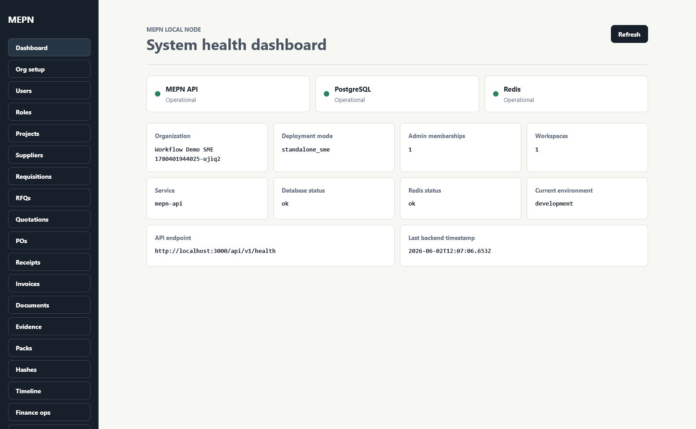
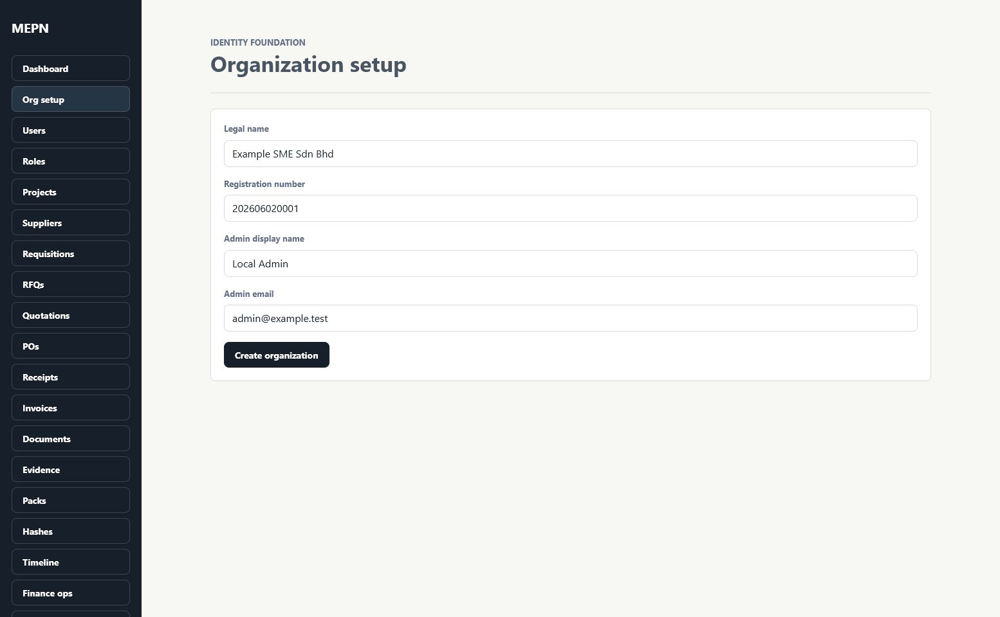
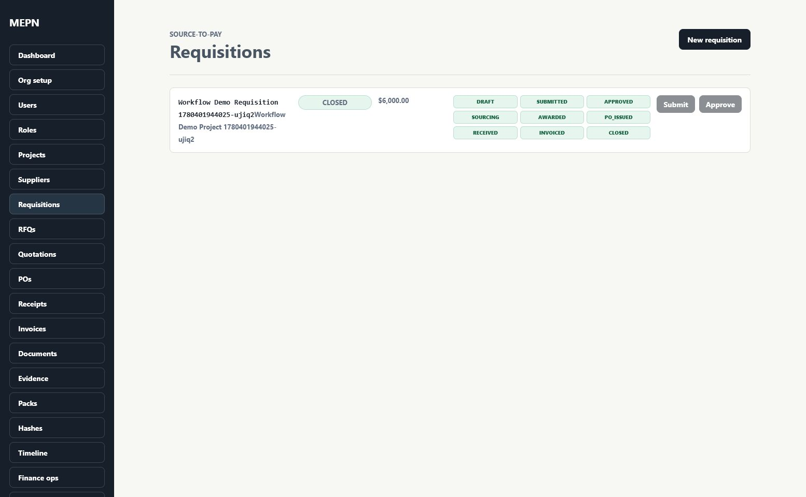
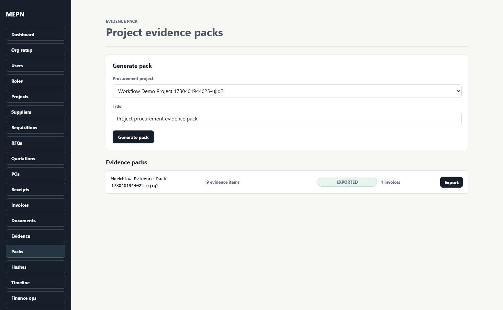
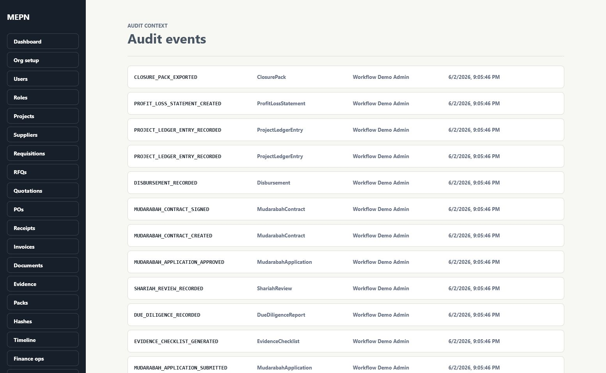
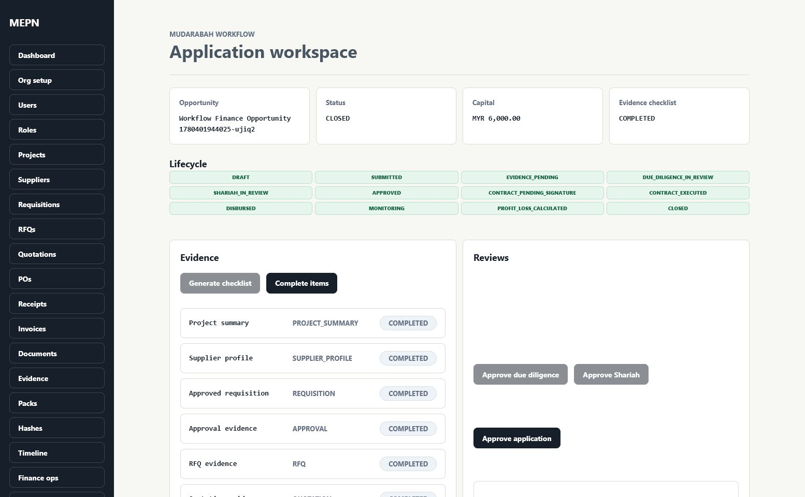
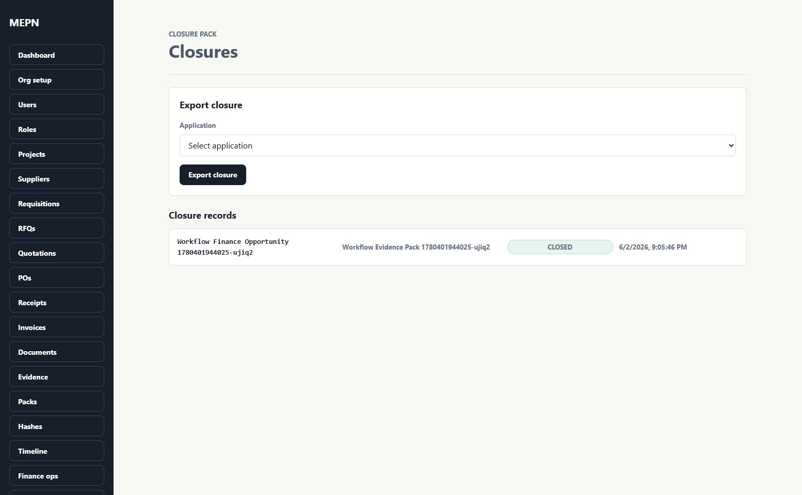

# Skeletal App UI State Documentation

## Purpose
This walkthrough documents the current UI states of the skeletal MEPN web application. The app is still unfinished, but these screenshots show the working navigation flow, visible UI states, current behavior, and areas that are mocked or deferred for the final version.

Screens were captured from the local development app on June 2, 2026 using a seeded demo organization:

- Organization: `Workflow Demo SME 1780401944025-ujiq2`
- Flow covered: dashboard, organization setup, procurement, evidence/audit, mudarabah finance, and closure.

## Main User Journey
1. User opens the dashboard and confirms system health.
2. User can access local organization setup.
3. User reviews a procurement requisition created through the source-to-pay path.
4. User generates and exports an evidence pack.
5. User reviews audit events created by the workflow.
6. User opens a mudarabah application workspace and verifies evidence/review status.
7. User confirms the closure pack state after profit/loss and closure export.

## Transition Summary
Dashboard health confirms the local API, PostgreSQL, and Redis are reachable. From there, the sidebar navigation moves the user into setup, procurement, evidence, audit, finance, and closure screens. The captured demo flow uses seeded backend records so the screenshots show meaningful working states rather than empty pages.

## Screen 01 - Dashboard

Status: Working

The user sees the MEPN local node dashboard with API, PostgreSQL, and Redis health indicators. The dashboard also shows the current organization, deployment mode, workspace count, and backend timestamp.

Action that caused this state: The user opens `/dashboard` with an active organization context.

What currently works:
- Health endpoint is called from the frontend.
- API, database, and Redis status are displayed.
- Organization context is shown when an organization/session is available.

Unfinished or mocked:
- Authentication is still local/dev style.
- Real OAuth/OIDC identity is not integrated yet.

Final intended behavior:
- The dashboard should use real authenticated user claims and organization scope.
- Health details should remain available for local/admin diagnostics.

## Screen 02 - Organization Setup

Status: Working for local/dev setup

The user sees the local organization setup form. It collects legal name, registration number, admin display name, and admin email.

Action that caused this state: The user opens `/org/setup`.

What currently works:
- The form can create an organization.
- The backend creates an admin user, role, membership, workspace, and audit event.
- The frontend stores local session identifiers after setup.

Unfinished or mocked:
- Password handling and full login are not implemented.
- OIDC/OAuth integration is deferred.

Final intended behavior:
- Setup should be guarded by an onboarding/auth flow.
- Admin identity should come from verified authentication instead of local-only session storage.

## Screen 03 - Procurement Requisition State

Status: Working skeletal procurement lifecycle

The user sees a requisition that has passed through the source-to-pay workflow. The requisition lifecycle track shows progress through draft, submission, approval, sourcing, purchase order, receiving, invoicing, and closure.

Action that caused this state: The user opens `/procurement/requisitions` after a seeded procurement workflow has been completed.

What currently works:
- Requisition records are scoped to organization.
- State transitions are persisted.
- Submit and approve actions work when the requisition is in the right state.
- Audit events are created for major transitions.

Unfinished or mocked:
- Role enforcement is not fully wired into every UI action.
- Supplier-facing quotation entry is represented as an internal screen.
- Advanced approval routing is not implemented yet.

Final intended behavior:
- Procurement screens should enforce permissions and workspace scope.
- Approvals should support richer reviewer assignment and segregation rules.
- Supplier interaction should be connected to a portal or integration path.

## Screen 04 - Evidence Pack Exported

Status: Working local evidence pack generation

The user sees a generated project evidence pack. The pack aggregates procurement records such as project summary, requisition, approval, RFQ, quotation, purchase order, receipt, invoice, supplier profile, and document-related evidence where available.

Action that caused this state: The user opens `/evidence/packs` after the evidence pack has been generated and exported.

What currently works:
- Evidence pack records are created from procurement data.
- Export updates the pack status.
- Local hash records and outbox events can be created during export.

Unfinished or mocked:
- Fabric anchoring is not part of the core UI flow yet.
- Evidence export is local/system-level rather than a polished downloadable bundle.
- Real object storage UX is still minimal.

Final intended behavior:
- Export should produce a reviewer-friendly evidence bundle.
- Hashes should be anchorable through the integration adapter flow.
- Documents should use full MinIO/S3-backed upload and retrieval.

## Screen 05 - Audit Events

Status: Working audit timeline list

The user sees audit events generated by the organization, procurement, evidence, and finance workflows. This demonstrates that major state changes are recorded.

Action that caused this state: The user opens `/audit` after the workflow has created records.

What currently works:
- Audit events are persisted.
- Event type, entity type, entity ID, actor, and timestamp are visible.
- Events are scoped by organization context.

Unfinished or mocked:
- Filtering, search, and pagination are basic.
- Audit anchoring is local/mock-ready but not fully exposed in this screen.

Final intended behavior:
- Reviewers should be able to filter by entity, actor, event type, and date.
- Audit timelines should link directly back to source records and evidence packs.

## Screen 06 - Finance Application Workspace

Status: Working skeletal mudarabah workflow

The user sees the finance application workspace after the application has moved through checklist generation, due diligence, Shariah review, contract execution, disbursement, monitoring, profit/loss calculation, and closure.

Action that caused this state: The user opens `/finance/applications/:id` for the seeded mudarabah application.

What currently works:
- Application status is displayed.
- Evidence checklist status is visible.
- Lifecycle track shows the expected finance states.
- Due diligence and Shariah review gates exist in the workflow.

Unfinished or mocked:
- Contract document generation is represented as a record, not a full generated PDF/document workflow.
- Financing provider integrations are mocked/deferred.
- The UI does not yet separate financier, Shariah reviewer, procurement officer, and auditor views.

Final intended behavior:
- Contract generation should be connected to document/e-signature workflows.
- Review decisions should use role-scoped screens.
- Financing actions should produce clear audit and outbox side effects.

## Screen 07 - Closure Pack

Status: Working skeletal closure state

The user sees a closure pack record linked back to the finance opportunity and evidence pack. The status shows the workflow has reached `CLOSED`.

Action that caused this state: The user opens `/finance/closures` after profit/loss statement generation and closure export.

What currently works:
- Closure records can be created after profit/loss calculation.
- Closure links back to the application opportunity and evidence pack.
- The UI shows the closed state.

Unfinished or mocked:
- Closure export is not yet a complete downloadable dossier.
- Detailed reviewer sign-off and final archive behavior are not implemented.

Final intended behavior:
- Closure should export a complete pack containing procurement evidence, finance records, audit timeline, hashes, and reviewer decisions.
- The pack should be suitable for supervisor, auditor, or financier review.

## Developer and Reviewer Notes
- API calls are real local REST calls against the NestJS backend.
- PostgreSQL, Redis, and MinIO run through Docker Compose.
- The screenshots use seeded development data, not production data.
- Local/dev auth is still used; final OIDC integration is pending.
- Fabric, ERP, e-signature, finance API, and webhook integrations should stay behind adapters and outbox events.
- Some integration side effects are mock-based by design at this stage.

## Current Status
The skeletal app has a working UI shell, navigation, health dashboard, organization setup, procurement path, evidence/audit surfaces, mudarabah finance workflow, and closure state. Core records persist through the backend and database.

## Next Steps
1. Add role-specific navigation and permission-based screen access.
2. Improve form validation and empty/error states across all modules.
3. Add richer evidence document upload and downloadable pack export.
4. Expose audit timeline filtering per entity and workflow.
5. Replace local/dev auth with OIDC.
6. Keep Fabric, ERP, finance API, e-signature, and webhook functionality adapter-driven until the internal workflow is stable.
